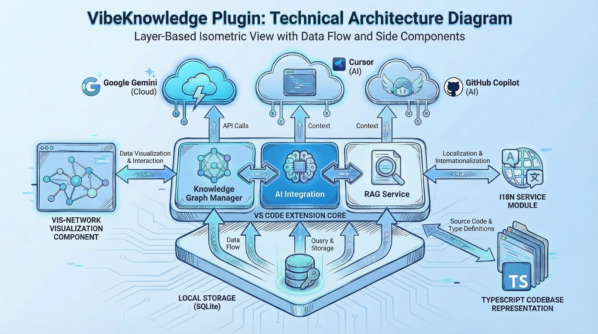
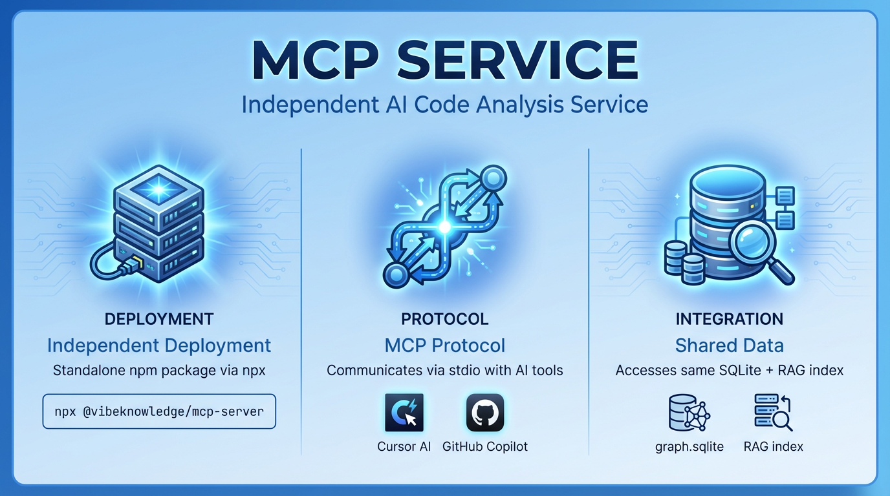

# VibeKnowledge - VS Code 知识图谱插件

> 将你的代码库转化为智能知识网络，让 AI 编程更高效

一个基于知识图谱和 SQLite 的 VS Code 插件，帮助开发者理解和管理代码库中的复杂关系，同时为 AI 编程提供持久化的项目上下文。

| 产品速览 | 功能亮点 |
| --- | --- |
|  |  |
|  |  |

## 📋 目录

- [核心理念](#核心理念)
- [当前状态](#当前状态)
  - [国际化支持](#国际化支持进行中)
- [快速开始](#快速开始)
- [项目结构](#项目结构)
- [核心功能](#核心功能)
- [技术架构](#技术架构)
- [开发指南](#开发指南)
- [演示文档](#演示文档)

---

## 🎯 核心理念

VibeKnowledge 将 VS Code 工作区本身变成一个**智能知识图谱**，通过三个核心概念构建项目知识：

### 1. 实体 (Entities)
代码库中的各种元素，具有精确的代码位置：
- 代码元素：Function、Class、Interface、Variable
- 文件系统：File、Directory
- 业务概念：API、Service、Component、Database

### 2. 关系 (Relations)
实体之间的连接：
- `uses` - 使用关系
- `calls` - 调用关系
- `extends` - 继承关系
- `implements` - 实现关系
- `depends_on` - 依赖关系

### 3. 观察记录 (Observations)
关于实体的笔记和注释，这是知识图谱的核心价值：
- 性能警告和优化建议
- 设计决策说明
- Bug 记录和修复历史
- 重构待办事项
- 团队协作笔记

**核心价值**：
- 🧠 **代码理解助手** - 可视化代码关系，快速理解复杂系统
- 📝 **项目记忆系统** - 持久化保存设计决策、重构笔记、性能警告
- 🤖 **AI 编程加速器** - 深度集成 Cursor 和 GitHub Copilot，为 AI 提供项目上下文
- 👥 **团队知识共享** - 知识图谱可被 Git 追踪，团队协作更顺畅

---

## ✅ 当前状态

**项目已完成所有核心功能！** 🎉

VibeKnowledge 是一个功能完整的 VS Code 知识图谱插件，包含四大核心模块：

### 1️⃣ 知识图谱管理（手动）
- ✅ 实体、关系、观察记录的完整 CRUD
- ✅ SQLite 本地持久化存储
- ✅ 交互式可视化图谱（D3.js）
- ✅ 完整的 VS Code UI 集成

### 2️⃣ 自动图谱生成 🆕
- ✅ **静态代码分析**：基于 TypeScript/JavaScript 正则解析，无需 AI
- ✅ **自动提取实体**：Class、Interface、Function、Variable
- ✅ **自动识别关系**：extends、implements、uses、imports
- ✅ **依赖注入检测**：构造函数参数、@Inject 装饰器、成员变量类型
- ✅ **方法签名分析**：返回类型、参数类型、泛型参数
- ✅ **接口属性分析**：接口内属性类型依赖
- ✅ **函数内部依赖**：检测函数体内的类实例化、静态方法调用
- ✅ **NestJS 装饰器**：@Module 装饰器的 imports/controllers/providers 分析
- ✅ **TypeORM 关系**：@ManyToOne/@OneToMany 等装饰器的实体引用
- ✅ **观察记录支持**：自动图谱实体也可添加观察记录，重新分析时保留
- ✅ **双图谱架构**：手动图谱与自动图谱完全隔离，互不干扰
- ✅ **视图切换**：一键切换手动图谱 / 自动图谱 / 合并视图
- ✅ **增量更新**：重新分析时智能对比新旧实体，自动保留未变更实体的观察记录

### 3️⃣ AI 协同功能
- ✅ Cursor 和 GitHub Copilot 深度集成
- ✅ **图谱源选择**：生成配置时可选手动/自动/合并图谱 🆕
- ✅ 知识图谱导出（Markdown / JSON）
- ✅ 依赖链分析和循环依赖检测
- ✅ 技术栈自动检测（JS/TS 项目）
- ✅ 快速上下文导出

### 4️⃣ 持久知识库（RAG）
- ✅ Google Gemini File Search 云端托管
- ✅ 自动索引文档到云端（增量）
- ✅ 智能问答（Ask Question）
- ✅ 多格式支持（100+ 种格式）
- ✅ 项目完全隔离

**代码量**：约 5000+ 行 TypeScript

### 🌐 国际化支持（已完成）✨

VibeKnowledge 已完成完整的多语言支持系统：

- ✅ **语言切换框架**：完整的 i18n 服务和类型系统
- ✅ **中英文双语**：界面、命令、提示信息全面支持中英文切换
- ✅ **动态切换**：运行时即时切换语言，无需重启
- ✅ **日期本地化**：日期时间根据语言自动格式化（zh-CN / en-US）
- ✅ **快捷切换**：视图标题栏添加语言切换按钮

**切换方式**：
1. **配置切换**：设置 → 搜索 "Knowledge Graph Language" → 选择 `zh` 或 `en`
2. **命令切换**：命令面板 → "Knowledge: Switch Language" → 选择语言
3. **快捷按钮**：知识图谱/RAG 视图标题栏 → 点击语言图标 🌐

**已完成的国际化模块**：
- ✅ 所有命令和菜单（实体、关系、观察记录、RAG、导出等）
- ✅ UI 提供者（树视图、悬浮提示、CodeLens）
- ✅ 导出服务（Markdown/JSON 导出内容）
- ✅ RAG 功能（问答、索引、Store 管理）
- ✅ 扩展激活和错误提示
- ✅ 进度提示和成功消息

### 🔌 MCP Server（已完成）🆕

> **Model Context Protocol (MCP)** 是一个开放协议，让 AI 模型能够安全地访问外部工具和数据源。

我们已经实现了首个独立的 MCP Server，可让 **Cursor** 和 **GitHub Copilot** 直接调用知识图谱与 RAG 能力，并在生产环境稳定运行。

#### 当前能力
- ✅ 独立部署：`npx @vibeknowledge/mcp-server --workspace <project>` 即可启动
- ✅ 复用现有数据：直接读取 `.vscode/.knowledge/graph.sqlite` 与云端/本地 RAG 索引
- ✅ 图谱检索工具：`search_entities`（实体）、`search_observations`（观察记录）
- ✅ 关系查询工具：`knowledge://relations`（按动词/实体筛选依赖）
- ✅ 概览资源：`knowledge://overview`，一键查看实体/关系/观察记录统计
- ✅ 工具接口：`ask_question`（自动根据 `rag.mode` 选择 cloud/local RAG，返回引用）
- ✅ 文档化：详见《[MCP 使用指南](./MCP_USAGE.md)》，包含 Cursor/GitHub Copilot 配置示例

#### 架构设计

```
┌─────────────────────────────────────────────────────────┐
│            AI Client (Cursor / GitHub Copilot)          │
└─────────────────────────┬───────────────────────────────┘
                          │ MCP Protocol (stdio)
                          ▼
┌─────────────────────────────────────────────────────────┐
│                 VibeKnowledge MCP Server                │
│  ┌─────────────┐  ┌─────────────┐  ┌─────────────────┐  │
│  │  Resources  │  │    Tools    │  │     Prompts     │  │
│  └──────┬──────┘  └──────┬──────┘  └────────┬────────┘  │
└─────────┼────────────────┼──────────────────┼───────────┘
          ▼                ▼                  ▼
┌─────────────────────────────────────────────────────────┐
│        graph.sqlite + Knowledge/ 文档 + RAG 索引         │
└─────────────────────────────────────────────────────────┘
```

#### Resources（已上线）

| Resource URI | 说明 |
|--------------|------|
| `knowledge://overview` | 项目知识图谱概览（实体数、关系数、观察记录统计等） |

#### Tools（已上线）

| Tool 名称 | 说明 | 参数 |
|-----------|------|------|
| `search_entities` | 模糊搜索实体 | `query?: string, type?: string, filePath?: string, limit?: number` |
| `search_observations` | 查询观察记录 | `query?: string, entityId?: string, limit?: number` |
| `knowledge://relations` | 列出关系记录 | `verb?: string, source?: string, target?: string, limit?: number` |
| `ask_question` | RAG 智能问答 | `question: string` |

#### 使用场景示例（现状）

配置好 MCP 后，在 Cursor 中：

```
用户：帮我分析 UserService 的依赖

AI：(自动调用 search_entities + knowledge://relations)
   
   找到 UserService，并列出 uses/depends_on 关系链，帮助快速定位受影响的组件。
```

> 📘 **使用说明**：详见《[MCP 使用指南](./MCP_USAGE.md)》，包含 Cursor / GitHub Copilot 配置与常见问题

---

## 🚀 快速开始

### 安装

```bash
# 1. 克隆仓库
git clone https://github.com/yourusername/vibecoding.git
cd vibecoding

# 2. 安装依赖
npm install

# 3. 编译
npm run compile

# 4. 在 VS Code 中按 F5 启动调试
```

### 基本使用

#### 知识图谱功能
1. **创建实体**：选中代码 → 右键 → "Knowledge: Create Entity from Selection"
2. **添加观察记录**：鼠标悬停在实体上 → 点击"Add Observation"
3. **查看知识图谱**：点击侧边栏的"Knowledge Graph"图标
4. **搜索**：命令面板 → "Knowledge: Search Graph"

#### RAG 知识库功能 🆕
**Cloud 模式 (Gemini)**：
1. **配置 API Key**：设置 → 搜索 "Gemini API Key" → 填入你的密钥
2. **添加文档**：在项目根目录创建 `Knowledge/` 文件夹，添加文档
3. **自动索引**：文档自动上传到 Gemini，无需手动操作

**Local 模式 (OpenAI Compatible) 🆕**：
1. **切换模式**：设置 → 搜索 "RAG Mode" → 选择 `local`
2. **配置接口**：设置 `Local: Api Base` (例如 `http://localhost:11434/v1` 或其他 OpenAI 兼容接口)
3. **配置模型**：
   - `Local: Embedding Model` (例如 `text-embedding-3-small` 或 `nomic-embed-text`)
   - `Local: Inference Model` (例如 `gpt-3.5-turbo` 或 `llama3`)
4. **重建索引**：切换配置后，建议执行 `Knowledge: Rebuild RAG Index`

#### AI 场景切换功能 🆕
扩展内置 8 个不同的 AI 场景模板，可根据当前工作内容快速切换：

| 场景 | 适用时机 | 包含内容 |
|------|----------|----------|
| 🔹 **基础规范** | 日常开发（默认） | 代码规范、命名约定、错误处理、安全性 |
| 🎨 **前端开发** | 开发前端功能 | UI组件、样式、状态管理、性能优化 |
| ⚙️ **后端开发** | 开发后端功能 | 数据库、中间件、服务集成、安全性 |
| 🔌 **API 开发** | 专注API开发 | 路由设计、参数验证、错误处理、API文档 |
| 🧪 **测试场景** | 编写测试 | 测试用例、TDD、覆盖率、Mock |
| 🐛 **调试优化** | 修复问题/优化 | 错误诊断、性能优化、代码审查、重构 |
| 📚 **文档编写** | 编写文档 | API文档、代码注释、README |
| 🚀 **DevOps** | 环境/部署相关 | 环境配置、CI/CD、Docker、部署 |

**使用方法**：
1. **快速切换**：点击右下角状态栏的场景图标，或运行命令 `Knowledge: Switch AI Scenario`
2. **查看当前场景**：运行命令 `Knowledge: Show Current AI Scenario`
3. **自动应用**：切换场景后会提示是否重新生成 AI 配置文件
4. **自定义**：基础场景支持自定义，在 `.vscode/.knowledge/ai-template.md` 添加项目特定规范
5. **中英文支持**：扩展内置中英文双语模板，根据语言设置自动选择（8个场景 × 2种语言 = 16个模板）

---

## 📁 项目结构

```
vibecoding/
├── src/
│   ├── extension.ts                  # ✅ 插件入口
│   ├── services/                     # ✅ 核心服务层
│   │   ├── database.ts               # 数据库服务
│   │   ├── entityService.ts          # 实体管理（手动图谱）
│   │   ├── relationService.ts        # 关系管理（手动图谱）
│   │   ├── observationService.ts     # 观察记录管理
│   │   └── autoGraph/                # 🆕 自动图谱模块
│   │       ├── index.ts              # 模块导出
│   │       ├── types.ts              # 类型定义
│   │       ├── autoGraphService.ts   # 自动图谱数据服务
│   │       └── codeAnalyzer.ts       # 代码静态分析器
│   ├── providers/                    # ✅ VS Code UI 提供者
│   │   ├── hoverProvider.ts          # 悬浮提示
│   │   ├── codeLensProvider.ts       # CodeLens
│   │   └── treeDataProvider.ts       # 树视图
│   ├── ui/                          # ✅ 命令处理器
│   │   ├── commands/
│   │   │   ├── entityCommands.ts     # 实体命令
│   │   │   └── autoGraphCommands.ts  # 🆕 自动图谱命令
│   │   └── webview/
│   │       └── graphView.ts          # 图谱可视化（支持模式切换）
│   └── utils/                       # ✅ 工具函数
│       └── types.ts                 # 类型定义
├── package.json                      # 插件配置
├── tsconfig.json                     # TypeScript 配置
├── README.md                         # 项目说明（本文件）
├── Demo.md                           # 演示指南
└── 项目结构.md                       # 项目结构详细说明

图例：
  ✅ 已实现
  🔜 计划中
```

### 数据存储

```
项目根目录/
├── .vscode/
│   └── .knowledge/
│       └── graph.sqlite              # 知识图谱数据库（包含 RAG 索引）
└── Knowledge/                        # ✅ RAG 文档知识库
    ├── architecture.md               # 架构文档
    ├── api-guide.md                  # API 指南
    └── decisions/                    # 设计决策
        └── adr-001.md
```

**RAG Store 隔离机制**：
- 每个项目自动生成唯一的 Store ID（基于项目路径 hash）
- 多个项目可以使用同一个 Gemini API Key
- 文档索引完全隔离，不会混淆
- Store 信息存储在本地 SQLite 数据库

---

## ✨ 核心功能

### 🗂️ 知识图谱管理

#### 基础图谱功能
- ✅ **实体管理**：手动创建和管理代码实体（Function、Class、Interface、Variable 等）
- ✅ **关系管理**：建立实体间的关系（uses、calls、extends、implements、depends_on）
- ✅ **观察记录**：为实体添加笔记、警告、TODO、设计决策等观察记录（支持多行编辑，若实体暂无记录会自动创建首条笔记）
- ✅ **模糊搜索**：快速搜索实体和观察记录
- ✅ **数据持久化**：基于 SQLite 的本地数据库存储

#### UI 集成
- ✅ **侧边栏树视图**：按类型分组显示所有实体和关系
- ✅ **悬浮提示**：鼠标悬停显示实体信息、观察记录、关系网络
- ✅ **CodeLens**：代码上方显示实体统计信息
- ✅ **右键菜单**：快速创建实体、添加观察、建立关系
- ✅ **命令面板**：完整的命令集合，快速访问所有功能

#### 可视化
- ✅ **交互式图谱**：基于 D3.js 的力导向图形化展示
- ✅ **自动布局**：节点自动排列，避免重叠
- ✅ **多重边分离**：同方向的多条关系自动以不同弧线显示
- ✅ **循环依赖检测**：自动识别并标记循环依赖
- ✅ **双击跳转**：双击节点直接跳转到代码位置
- ✅ **拖拽交互**：支持节点拖拽、缩放、平移
- ✅ **节点悬浮详情**：Tooltip 自动展示观察记录摘要及剩余条数，快速掌握风险与 TODO
- ✅ **图谱模式切换**：手动图谱 / 自动图谱 / 合并视图 一键切换

---

### ⚡ 自动图谱生成 🆕

基于静态代码分析自动生成依赖关系图谱，无需 AI，确定性分析。

#### 支持的语言
- ✅ TypeScript (.ts, .tsx)
- ✅ JavaScript (.js, .jsx)

#### 自动提取的实体类型

| 类型 | 说明 | 示例 |
|------|------|------|
| `class` | 类定义 | `class UserService {}` |
| `interface` | 接口定义 | `interface UserData {}` |
| `function` | 函数定义 | `function createUser() {}` |
| `variable` | 导出变量 | `export const config = {}` |

> 💡 **注意**：只分析工作区内的代码，外部依赖（如 @nestjs、typeorm）不会生成节点

#### 自动识别的关系类型

| 关系 | 说明 | 示例 |
|------|------|------|
| `extends` | 类继承 | `class A extends B` |
| `implements` | 接口实现 | `class A implements B` |
| `uses` | 依赖使用 | 构造函数注入、成员变量、返回类型 |
| `imports` | 模块导入 | `import { X } from './x'` |

#### 依赖检测场景

```typescript
// ✅ 类继承
class UserController extends BaseController {}

// ✅ 接口实现（仅工作区内的接口）
class ProfileModule implements LocalInterface {}

// ✅ 构造函数依赖注入
class ArticleController {
  constructor(private articleService: ArticleService) {}
}

// ✅ 方法返回类型
async getProfile(): Promise<ProfileRO> {}

// ✅ 方法参数类型
createArticle(@Body() dto: CreateArticleDto) {}

// ✅ 接口属性类型
interface ArticleData {
  author?: UserData;  // ArticleData --uses--> UserData
}

// ✅ @Inject 装饰器
@Inject(ConfigService) private config: ConfigService

// ✅ @Module 装饰器（NestJS）
@Module({
  imports: [UserModule, ArticleModule],  // --uses--> UserModule, ArticleModule
  controllers: [AppController],
  providers: [AppService],
})
class ApplicationModule {}

// ✅ TypeORM 关系装饰器
@ManyToOne(type => UserEntity, user => user.articles)
author: UserEntity;  // --uses--> UserEntity

// ✅ 函数内部依赖（new 实例化、静态方法调用）
async function bootstrap() {
  const app = await NestFactory.create(ApplicationModule);  // --uses--> ApplicationModule
  const builder = new DocumentBuilder();  // --uses--> DocumentBuilder（如果在工作区内）
}
```

#### 使用方法

1. **分析整个工作区**：命令面板 → `Knowledge: Analyze Workspace (Auto Graph)`
2. **分析当前文件**：命令面板 → `Knowledge: Analyze Current File (Auto Graph)`
3. **查看统计**：命令面板 → `Knowledge: View Auto Graph Statistics`
4. **清空自动图谱**：命令面板 → `Knowledge: Clear Auto Graph`
5. **切换视图**：在图谱可视化界面点击顶部按钮切换 📝手动 / ⚡自动 / 🔗合并
6. **添加观察记录**：在侧边栏 Explorer 中右键自动图谱实体 → `Add Observation`
7. **编辑观察记录**：右键观察记录 → `Edit Observation`（支持多行编辑）
8. **删除观察记录**：右键观察记录 → `Delete Observation`

#### 配置选项

| 配置项 | 说明 | 默认值 |
|--------|------|--------|
| `knowledgeGraph.autoAnalyze.enabled` | 启用自动分析 | `true` |
| `knowledgeGraph.autoAnalyze.onSave` | 保存时自动分析 | `false` |
| `knowledgeGraph.autoAnalyze.include` | 包含的文件模式 | `["**/*.ts", "**/*.tsx", "**/*.js", "**/*.jsx"]` |
| `knowledgeGraph.autoAnalyze.exclude` | 排除的文件模式 | `["**/node_modules/**", "**/dist/**", "**/*.d.ts", "**/*.test.ts"]` |

#### 与手动图谱的区别

| 特性 | 手动图谱 | 自动图谱 |
|------|----------|----------|
| 创建方式 | 用户手动创建 | 静态分析自动生成 |
| 观察记录 | ✅ 支持 | ✅ 支持（重新分析时保留） |
| 数据隔离 | `entities` / `observations` 表 | `auto_entities` / `auto_observations` 表 |
| 数据更新 | 手动增删改 | 增量更新：删除的实体会移除，保留的实体保持观察记录 |
| 外部依赖 | 可手动添加 | 仅工作区内代码 |
| 适用场景 | 记录设计决策、重构笔记 | 快速理解代码依赖 + 标注关键节点 |

---

### 🤖 AI 协同功能

#### 知识图谱导出
- ✅ **Markdown 导出**：生成适合 AI 阅读的格式化文档
- ✅ **JSON 导出**：结构化数据导出
- ✅ **依赖链分析**：递归构建依赖树，检测循环依赖，统计传递依赖
- ✅ **按类型分组**：实体、关系、观察记录分类展示

#### AI 工具集成
- ✅ **Cursor 集成**：自动生成 `.cursorrules` 配置文件
- ✅ **GitHub Copilot 集成**：自动生成 `.github/copilot-instructions.md`
- ✅ **图谱源选择** 🆕：生成 AI 配置时可选择数据源
  - 📝 **手动图谱**：设计决策、观察记录、手动维护的关系
  - ⚡ **自动图谱**：静态分析生成的代码结构和依赖关系
  - 🔗 **合并图谱**：手动 + 自动，最完整的上下文
- ✅ **技术栈检测**：自动提取依赖信息
  - JavaScript/TypeScript 项目（`package.json`）
  - Java Maven 项目（`pom.xml`）
  - Python 项目（`requirements.txt`、`pyproject.toml`、`setup.py`）
- ✅ **场景切换**：8种内置场景模板，快速适应不同开发任务（前端/后端/测试/调试等）
- ✅ **一键生成**：同时生成所有 AI 配置文件
- ✅ **智能分类**：自动分类警告、TODO、已知问题

#### 快速上下文导出
- ✅ **实体上下文**：复制单个实体的完整上下文到剪贴板
- ✅ **文件上下文**：导出当前文件的所有实体和关系
- ✅ **AI 摘要**：生成项目整体摘要，供 AI 理解

---

### ☁️ 持久知识库（RAG）

#### RAG 模式
插件支持两种 RAG 模式，可根据隐私需求灵活切换：

1. **Cloud RAG (Google Gemini)**
   - ✅ **托管服务**：使用 Gemini File Search API，无需本地算力
   - ✅ **多格式支持**：原生支持 PDF、Word、代码等 100+ 种格式
   - ✅ **语义搜索**：Gemini 自动分块和检索

3. **Local RAG (本地模式)** 🆕
   - ✅ **数据隐私**：所有文档和向量数据仅存储在本地 SQLite，不上传云端
   - ✅ **模型灵活**：支持 Ollama、LocalAI、vLLM 等任何 OpenAI 兼容接口
   - ✅ **自定义配置**：可自定义 Embedding 模型和 Inference 推理模型
   - ✅ **多格式解析**：除纯文本外，内置 PDF / DOC / DOCX 解析，自动抽取正文参与本地索引
   - ✅ **轻量级实现**：
     - 采用 **SQLite (持久化) + 内存 (计算)** 架构，跨 Win/macOS/Linux 无额外依赖
     - 启动时加载向量到内存，用余弦相似度暴力检索，满足 VS Code 内常见的中小规模数据
     - 无需安装 Docker、Python/Rust 依赖或额外服务，开箱即用、故障可控
     - 数据随项目一起存储在 `.vscode/.knowledge/graph.sqlite`，便于备份与审查

#### 智能问答
- ✅ **Ask Question**：基于文档内容的智能问答
- ✅ **来源追溯**：显示答案的来源文档（Grounding Metadata）
- ✅ **Markdown 展示**：问答结果以格式化 Markdown 文档展示
- ✅ **可复制保存**：支持复制内容或保存为文件

#### 项目管理
- ✅ **项目隔离**：每个项目独立的 File Search Store，多项目完全隔离
- ✅ **API Key 配置**：通过 VS Code 设置管理 Gemini API Key
- ✅ **自动重连**：API Key 更新后自动重新初始化
- ✅ **Store 信息查看**：云模式展示实时云端统计；本地模式自动隐藏云端提示，仅显示本地元数据
- ✅ **索引重建**：Rebuild RAG Index 命令，完全同步本地和云端

#### 侧边栏管理
- ✅ **Documents (RAG) 视图**：显示已索引的文档列表
- ✅ **快捷操作**：问号图标（Ask Question）、信息图标（查看 Store 信息）、刷新图标（重建索引）
- ✅ **连接测试**：测试 Gemini API 连接状态

---

## 🏗️ 技术架构

### 技术栈

| 层次 | 技术选型 | 说明 |
|------|---------|------|
| **插件框架** | VS Code Extension API | 官方插件开发框架 |
| **语言** | TypeScript | 类型安全，开发体验好 |
| **数据库** | sql.js | WebAssembly SQLite，跨平台兼容 |
| **搜索** | LIKE 模糊查询 | 简单高效，适合中小型项目 |
| **可视化** | vis-network | 交互式图谱可视化 |
| **RAG 系统** | Google Gemini File Search API | 托管式向量搜索和智能问答 |
| **代码解析** | 正则表达式 + XML 解析 | 支持多种项目配置文件 |

### 核心数据流

```
用户操作
  ↓
VS Code UI (TreeView / Hover / CodeLens / Menu)
  ↓
Commands (entityCommands.ts)
  ↓
Services (entityService / relationService / observationService)
  ↓
Database (database.ts → SQLite)
  ↓
存储在 .vscode/.knowledge/graph.sqlite
```

### 数据库 Schema

```sql
-- ========== 手动图谱表 ==========

-- 实体表（手动）
CREATE TABLE entities (
    id TEXT PRIMARY KEY,
    name TEXT NOT NULL,
    type TEXT NOT NULL,
    file_path TEXT NOT NULL,
    start_line INTEGER NOT NULL,
    end_line INTEGER NOT NULL,
    description TEXT,
    created_at INTEGER NOT NULL,
    updated_at INTEGER NOT NULL
);

-- 关系表（手动）
CREATE TABLE relations (
    id TEXT PRIMARY KEY,
    source_entity_id TEXT NOT NULL,
    target_entity_id TEXT NOT NULL,
    verb TEXT NOT NULL,
    created_at INTEGER NOT NULL
);

-- 观察记录表
CREATE TABLE observations (
    id TEXT PRIMARY KEY,
    entity_id TEXT NOT NULL,
    content TEXT NOT NULL,
    created_at INTEGER NOT NULL,
    updated_at INTEGER NOT NULL
);

-- ========== 自动图谱表 🆕 ==========

-- 自动生成的实体表
CREATE TABLE auto_entities (
    id TEXT PRIMARY KEY,
    name TEXT NOT NULL,
    type TEXT NOT NULL,           -- class/interface/function/variable
    file_path TEXT NOT NULL,
    start_line INTEGER NOT NULL,
    end_line INTEGER NOT NULL,
    description TEXT,
    created_at INTEGER NOT NULL,
    updated_at INTEGER NOT NULL,
    metadata TEXT                 -- JSON 格式的额外信息
);

-- 自动生成的关系表
CREATE TABLE auto_relations (
    id TEXT PRIMARY KEY,
    source_entity_id TEXT NOT NULL,
    target_entity_id TEXT NOT NULL,
    verb TEXT NOT NULL,           -- extends/implements/uses/imports
    created_at INTEGER NOT NULL,
    metadata TEXT,
    FOREIGN KEY (source_entity_id) REFERENCES auto_entities(id) ON DELETE CASCADE,
    FOREIGN KEY (target_entity_id) REFERENCES auto_entities(id) ON DELETE CASCADE
);

-- 文件分析缓存表（增量分析用）
CREATE TABLE auto_file_cache (
    file_path TEXT PRIMARY KEY,
    content_hash TEXT NOT NULL,   -- MD5 哈希
    analyzed_at INTEGER NOT NULL
);

-- 自动图谱观察记录表 🆕
CREATE TABLE auto_observations (
    id TEXT PRIMARY KEY,
    entity_id TEXT NOT NULL,
    content TEXT NOT NULL,
    created_at INTEGER NOT NULL,
    updated_at INTEGER NOT NULL,
    FOREIGN KEY (entity_id) REFERENCES auto_entities(id) ON DELETE CASCADE
);

-- 索引优化
CREATE INDEX idx_entities_type ON entities(type);
CREATE INDEX idx_entities_file_path ON entities(file_path);
CREATE INDEX idx_entities_name ON entities(name);
CREATE INDEX idx_auto_entities_type ON auto_entities(type);
CREATE INDEX idx_auto_entities_file_path ON auto_entities(file_path);
CREATE INDEX idx_auto_entities_name ON auto_entities(name);
CREATE INDEX idx_auto_relations_source ON auto_relations(source_entity_id);
CREATE INDEX idx_auto_relations_target ON auto_relations(target_entity_id);
CREATE INDEX idx_auto_observations_entity ON auto_observations(entity_id);
```

---

## 🛠️ 开发指南

### 环境要求

- Node.js >= 16.x
- VS Code >= 1.80.0
- TypeScript >= 4.9.0

### 开发命令

```bash
# 安装依赖
npm install

# 编译
npm run compile

# 监听模式（开发时使用）
npm run watch

# 运行测试
npm test

# 打包插件
npm run package

# 代码检查
npm run lint
```

### 调试

1. 在 VS Code 中打开项目
2. 按 `F5` 启动调试
3. 会打开一个新的 VS Code 窗口（Extension Development Host）
4. 在新窗口中测试插件功能

### 代码规范

- 使用 TypeScript strict 模式
- 使用 async/await 而非 callback
- 错误处理使用 try/catch
- 命名规范：
  - 文件名：camelCase.ts
  - 类名：PascalCase
  - 函数/变量：camelCase
  - 常量：UPPER_SNAKE_CASE

---

## 📖 演示文档

详细的演示指南和使用场景，请查看：

- **[Demo.md](./Demo.md)** - 完整演示指南
  - 基于 NestJS RealWorld Example App 的演示
  - 包含 5 个实际使用场景
  - 从基础功能到 AI 协同的完整演示脚本
  - 持久知识库和需求文档转换演示

---

## 📚 参考资料

### 官方文档
- [VS Code Extension API](https://code.visualstudio.com/api)
- [sql.js 文档](https://sql.js.org/)
- [vis-network 文档](https://visjs.github.io/vis-network/)
- [TypeScript Compiler API](https://github.com/Microsoft/TypeScript/wiki/Using-the-Compiler-API)
- [Google File Search Tool](https://ai.google.dev/gemini-api/docs/file-search)