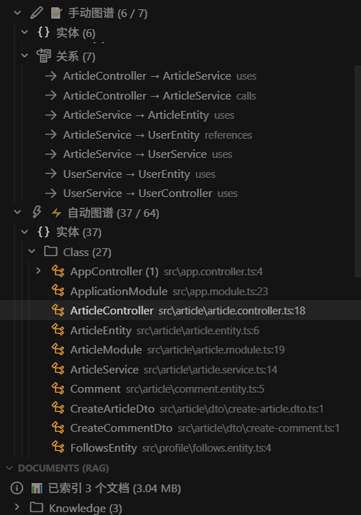
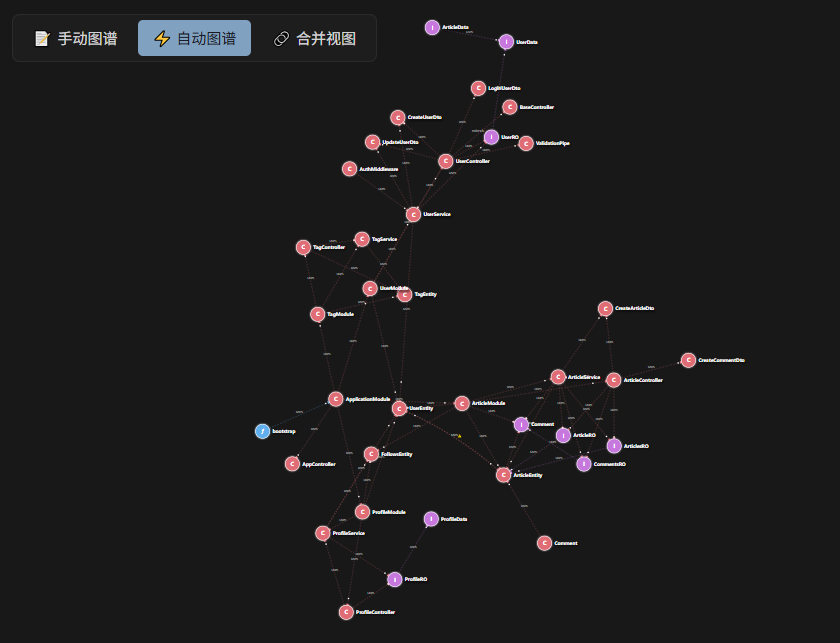

# VibeKnowledge

[English](./README.md) | [简体中文](./README_ZH.md)

VibeKnowledge is a VS Code extension for building a project knowledge graph alongside the code it describes. It stores code entities, relationships, and maintainer notes in a workspace-local SQLite database, then exposes that context through VS Code, AI configuration files, and an optional MCP server.

The repository is at version `0.1.0` and supports development from source, automated checks, and repeatable VSIX packaging. Before the first Marketplace release, create or verify the configured `davexxx1214` publisher account.

## Demo

https://github.com/user-attachments/assets/33b3774a-a142-4cbb-93cc-6768732e0723

| Explorer and RAG documents | AI scenario selection |
| --- | --- |
|  |  |

| Automatic graph | Manual graph |
| --- | --- |
|  |  |

## What it does

| Area | Current capabilities |
| --- | --- |
| Manual knowledge graph | Create entities from code selections, connect them with typed relationships, and attach observations such as design decisions or refactoring notes. |
| Automatic graph | Analyze TypeScript and JavaScript files to extract classes, interfaces, functions, variables, imports, inheritance, and selected dependency relationships. |
| Visualization | Explore manual, automatic, or combined graphs in a `vis-network` webview and jump back to source locations. |
| AI context | Export graph data as Markdown or JSON, generate Cursor rules and GitHub Copilot instructions, and switch between built-in task scenarios. |
| RAG | Index documents with Gemini File Search or a configurable OpenAI-compatible endpoint, then ask questions from the VS Code sidebar. |
| MCP server | Read the same graph database from Cursor, GitHub Copilot, or another MCP client. |
| Graph sonification | Generate a Strudel pattern from graph structure and open it in an embedded Strudel player. This feature is experimental. |

VibeKnowledge stores its project data in:

```text
<workspace>/.vscode/.knowledge/graph.sqlite
```

Automatic analysis currently supports `.ts`, `.tsx`, `.js`, and `.jsx` files. It uses static pattern analysis rather than a full TypeScript compiler model, so treat the generated graph as a starting point and keep important design knowledge in manual observations.

## Run from source

### Requirements

- Node.js 20 is recommended for development.
- VS Code 1.80 or newer.

### Setup

```bash
git clone https://github.com/davexxx1214/VibeKnowledge.git
cd VibeKnowledge
npm ci
npm run compile
code .
```

Press `F5` in VS Code and select **Run Extension**. In the Extension Development Host, open a TypeScript or JavaScript project and run **Knowledge: Analyze Workspace (Auto Graph)** from the Command Palette.

You can also build continuously while editing:

```bash
npm run watch
```

## Main workflows

### Maintain a manual graph

1. Select code in the editor.
2. Run **Knowledge: Create Entity from Selection** from the context menu or Command Palette.
3. Add relationships and observations from the VibeKnowledge explorer.
4. Run **Knowledge: Visualize Graph** to inspect the graph.

Manual observations work well for information that static analysis cannot recover, including architectural decisions, known risks, migration notes, and refactoring constraints.

### Generate an automatic graph

Run one of these commands from the Command Palette:

- `Knowledge: Analyze Workspace (Auto Graph)`
- `Knowledge: Analyze Current File (Auto Graph)`
- `Knowledge: View Auto Graph Statistics`
- `Knowledge: Clear Auto Graph`

Automatic analysis is disabled by default. Enable `knowledgeGraph.autoAnalyze.enabled` if you want VibeKnowledge to analyze matching files without running the command manually. The `include` and `exclude` settings control which files it scans.

### Use RAG

Create a `Knowledge/` directory at the project root and place the documents you want to index inside it. Then select a RAG mode in VS Code settings:

| Setting | Default | Purpose |
| --- | --- | --- |
| `knowledgeGraph.rag.mode` | `cloud` | Selects Gemini File Search or a configured OpenAI-compatible endpoint. |
| `knowledgeGraph.gemini.apiKey` | empty | Enables cloud RAG with Gemini. |
| `knowledgeGraph.rag.local.apiBase` | `http://localhost:8000/v1` | Sets the endpoint for local-mode embeddings and inference. |
| `knowledgeGraph.rag.local.embeddingModel` | `text-embedding-3-small` | Selects the embedding model exposed by the configured endpoint. |
| `knowledgeGraph.rag.local.inferenceModel` | `gpt-4.1` | Selects the inference model exposed by the configured endpoint. |

Cloud mode uploads indexed documents to Gemini File Search. Local mode stores chunks and vectors in the workspace database, but it still sends embedding and inference requests to the endpoint you configure. Review that endpoint's data policy before indexing private material, and do not commit API keys.

### Connect the MCP server

The MCP package lives in [`packages/mcp-server`](./packages/mcp-server). To build and run it from this checkout:

```bash
cd packages/mcp-server
npm ci
npm run build
node dist/index.js --workspace /path/to/your/project
```

The target workspace must already contain a VibeKnowledge database. Run the VS Code extension in that workspace before starting the server. Use `node dist/index.js --help` for the available database and RAG options. The existing [MCP guide](./MCP_USAGE.md) contains Cursor and GitHub Copilot configuration examples in Chinese.

## Development

### Commands

| Command | Purpose |
| --- | --- |
| `npm run compile` | Bundle the extension into `dist/extension.js`. |
| `npm run watch` | Rebuild when source files change. |
| `npm run lint` | Run ESLint against the TypeScript source. |
| `npm run check` | Compile, lint, and run the root test suite. |
| `npm run package` | Build a VSIX with `@vscode/vsce`. |
| `npm test` | Run the root Vitest suite. |
| `npm run test:coverage` | Run tests with V8 coverage. |

The MCP server has its own dependencies and scripts:

```bash
cd packages/mcp-server
npm ci
npm run build
npm test
```

### Repository layout

```text
src/
  commands/              AI scenario commands
  i18n/                  English and Chinese UI strings
  providers/             VS Code tree, hover, and CodeLens providers
  services/              Graph, RAG, export, and analysis services
  ui/                    Command handlers and webviews
packages/mcp-server/     Standalone MCP server
resources/scenarios/     Built-in AI task templates
presentation/            Demo media
```

## Documentation

- [English demo guide](./Demo_en.md)
- [中文演示指南](./Demo.md)
- [English project structure](./project_structure_en.md)
- [中文项目结构](./project_structure.md)
- [MCP 使用指南](./MCP_USAGE.md)
- [Contributing guide](./CONTRIBUTING.md)
- [Security policy](./SECURITY.md)
- [Changelog](./CHANGELOG.md)

Issues and pull requests are welcome. For a large change, open an issue first so the behavior and storage format can be discussed before implementation.

## License

VibeKnowledge is available under the [MIT License](./LICENSE).
