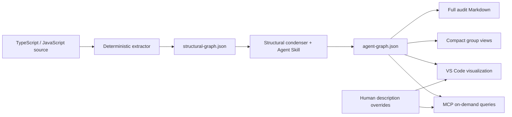

# VibeKnowledge

[English](./README.md) | [简体中文](./README_ZH.md)

VibeKnowledge is a VS Code extension and local MCP server that turns a TypeScript or JavaScript codebase into a compact, queryable knowledge graph for coding agents.

The project keeps code facts, curated views, and human-written descriptions separate. A deterministic extractor owns graph structure; the bundled Agent Skill creates focused framework and feature groups; humans may refine descriptions without manually maintaining nodes or edges.

## Why it exists

Giving an agent the entire repository or a large generated report consumes context before the task starts. VibeKnowledge instead creates a small routing index and lets the agent request only the relevant group, neighborhood, impact path, or source files.


```mermaid
flowchart LR
    Source["TypeScript / JavaScript source"] --> Extract["Deterministic extractor"]
    Extract --> Structural["structural-graph.json"]
    Structural --> Curate["Structural condenser + Agent Skill"]
    Curate --> Curated["agent-graph.json"]
    Curated --> Audit["Full audit Markdown"]
    Curated --> Compact["Compact group views"]
    Curated --> Visual["VS Code visualization"]
    Curated --> MCP["MCP on-demand queries"]
    Overrides["Human description overrides"] --> Visual
    Overrides --> MCP
```

## Measured context savings

The Phase 7 benchmark runs five fixed coding tasks against `nestjs-realworld-example-app`: locating behavior, adding a test, changing an API path, assessing impact, and tracing a dependency cycle.

At the recommended 600-token MCP query budget:

| Retrieval mode | Average input tokens | Evidence-coverage proxy | Files read | Tool calls |
| --- | ---: | ---: | ---: | ---: |
| Source search without a graph | 2,783 | 85.6% | 5.0 | 6.0 |
| Compact Markdown group | 2,426 | 72.6% | 4.8 | 6.8 |
| MCP on-demand graph query | 1,710 | 90.3% | 3.6 | 4.6 |

MCP used **1,073 fewer estimated input tokens per task**, a **38.6% reduction** from source-only retrieval, while the evidence-coverage proxy improved by 4.8 percentage points. It used 29.5% fewer tokens than loading a compact Markdown group. Its average 411-token retrieval payload was 96.2% smaller than injecting the complete 10,679-token audit report.

These are reproducible conservative token estimates, not provider billing telemetry. Evidence coverage measures retrieval quality, not final model-answer quality. See the [full methodology and per-task results](./evaluation/phase7/results.md).

## Graph model

VibeKnowledge produces two graph layers:

- `structural-graph.json` contains deterministic source facts, locations, diagnostics, and structural paths. It is never injected wholesale into agent context.
- `agent-graph.json` contains independent version-1 groups curated from those facts. Generated keys, types, paths, and relations are authoritative.

The default `framework` group is a system-boundary view. It keeps only the startup chain, root module, top-level business modules, direct cross-module dependencies, shared infrastructure, and external systems.

Detailed module or feature groups keep component-level modules, APIs, services, entities, DTOs, interfaces, and one-hop direct dependencies. Methods, constructors, and tests are folded into their owning components. For each ordered entity pair, only the strongest useful relationship is retained.

Supported entity types:

```text
function  class  interface  variable  file  api  service  component  external
```

Supported relations:

```text
calls  extends  implements  depends_on  contains  references  imports  exports
```

There is no manual structural graph. Regeneration discards nodes and relations that the Skill no longer produces. Humans edit descriptions only; stable entity keys reconnect those overrides after regeneration.

## Generated files

```text
<workspace>/.vscode/.knowledge/
  structural-graph.json             deterministic source facts
  structural-graph.previous.json    previous valid structural snapshot
  cache/structural/index.json       incremental extraction cache
  agent-graph.json                  grouped curated graph
  knowledge-graph.md                complete human audit report
  agent-context/index.md            small routing index for agents
  agent-context/<group-key>.md      compact entity/path/relation view
  graph.sqlite                      descriptions and optional RAG data
```

`knowledge-graph.md` is for human review and should not be placed in the default agent instructions. Agents should start with `agent-context/index.md`, load one relevant group, and then inspect source or query MCP as needed.

## Quick start

### Run the extension from source

Requirements: Node.js 20 is recommended, and VS Code 1.80 or newer is required.

```bash
git clone https://github.com/davexxx1214/VibeKnowledge.git
cd VibeKnowledge
npm ci
npm run compile
code .
```

Press `F5`, choose **Run Extension**, open a target workspace in the Extension Development Host, and run **Knowledge: Install Dependency Graph Agent Skill** from the Command Palette.

### Generate a graph with the Skill

Ask an Agent Skills-compatible coding agent:

```text
$vibeknowledge-dependency-graph generate the framework graph
```

The same deterministic pipeline can be run directly:

```bash
node .agents/skills/vibeknowledge-dependency-graph/scripts/extract-structural-graph.mjs --workspace . --scope .
node .agents/skills/vibeknowledge-dependency-graph/scripts/validate-structural-graph.mjs .vscode/.knowledge/structural-graph.json .
node .agents/skills/vibeknowledge-dependency-graph/scripts/curate-structural-graph.mjs --workspace . --kind framework --name "Framework"
```

Add or refresh a detailed group without replacing unrelated groups:

```bash
node .agents/skills/vibeknowledge-dependency-graph/scripts/curate-structural-graph.mjs --workspace . --kind feature --scope src/article --key article-management --name "Article management"
```

Extraction is incremental: unchanged file contributions are reused, and changed files plus reverse importers are resolved again. Outputs are validated before atomic replacement. If an update is corrupt, newly broken, or abnormally smaller, the previous valid artifacts are preserved for review.

### Explore and edit descriptions

Run **Knowledge: Visualize Graph** and select one group from the list. The webview renders only that group. Source-backed nodes can jump to code, and raw neighborhood or structural-path views are loaded only when requested.

The graph defaults to **Low-performance mode**. Switch to **High-performance mode** in the graph toolbar to enable particles, flowing edges, glow, and interactive force-layout movement. The choice is saved on this machine as `knowledgeGraph.visualization.performanceMode` (`low` / `high`), and can also be changed in VS Code Settings.

Low mode computes a bounded static layout in short batches, caches recent group positions and zoom, and redraws only the dragged node and its incident edges during dragging. Hidden views pause animation and layout work in both modes. All nodes, relationships, tooltips, and code navigation remain available; the mode does not change generated files, MCP results, or background source extraction. Large graphs and source-analysis overhead may still require further optimization.

A `🧠 KG` CodeLens displays a source entity's current description. Human edits override generated prose across every group until **Knowledge: Restore Agent Description** is used.

## MCP server

Build and start the standalone server against a generated workspace:

```bash
cd packages/mcp-server
npm ci
npm run build
node dist/index.js --workspace /path/to/project
```

MCP exposes compact entity and relationship lookup plus structural cycle, coupling, boundary, diff, impact, community, and shortest-path analysis. Query output is token-budgeted and can fall back to source search when graph freshness checks fail.

See [MCP_USAGE.md](./MCP_USAGE.md) for Cursor and GitHub Copilot configuration examples.

The MCP package is an independent npm project, not an npm workspace. From the repository root, use `npm --prefix packages/mcp-server ci` and `npm --prefix packages/mcp-server run build`. VS Code uses `servers` in `.vscode/mcp.json`; Cursor uses `mcpServers` in `.cursor/mcp.json`. Point the executable argument at this checkout, and install native dependencies with the same Node.js runtime used by the MCP client. The relationship-list tool is named `list_relations`.

## Optional RAG

Documents under a workspace `Knowledge/` directory can be indexed with Gemini File Search or a configured OpenAI-compatible endpoint. Cloud mode uploads indexed documents to Gemini. Local mode stores chunks and vectors in `graph.sqlite`, but embedding and inference requests still go to the configured endpoint. Review its data policy before indexing private material, and never commit API keys.

The relevant settings are:

| Setting | Default |
| --- | --- |
| `knowledgeGraph.rag.mode` | `cloud` |
| `knowledgeGraph.gemini.apiKey` | empty |
| `knowledgeGraph.rag.local.apiBase` | `http://localhost:8000/v1` |
| `knowledgeGraph.rag.local.embeddingModel` | `text-embedding-3-small` |
| `knowledgeGraph.rag.local.inferenceModel` | `gpt-4.1` |

## Development

| Command | Purpose |
| --- | --- |
| `npm run compile` | Bundle the extension into `dist/extension.js`. |
| `npm run watch` | Rebuild on source changes. |
| `npm run lint` | Run ESLint. |
| `npm test` | Run the root Vitest suite. |
| `npm run check` | Compile, lint, and test. |
| `npm run test:coverage` | Generate V8 coverage. |
| `npm run package` | Build a VSIX. |

The MCP package has its own build and test commands:

```bash
cd packages/mcp-server
npm run build
npm test
```

Repository layout:

```text
src/                         VS Code extension
packages/mcp-server/         standalone MCP server
resources/skills/            installable Agent Skill
resources/scenarios/         optional AI task scenarios
evaluation/phase7/           retrieval benchmark and results
```

## Documentation

- [Graph schema](./resources/skills/vibeknowledge-dependency-graph/references/graph-schema.md)
- [MCP usage](./MCP_USAGE.md)
- [Project structure](./project_structure_en.md)
- [Contributing](./CONTRIBUTING.md)
- [Security](./SECURITY.md)
- [Changelog](./CHANGELOG.md)

## License

[MIT](./LICENSE)
