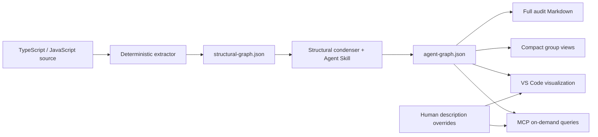

# VibeKnowledge

[English](./README.md) | [简体中文](./README_ZH.md)

VibeKnowledge is a VS Code extension with local Agent Skills and optional MCP access that turns a TypeScript or JavaScript codebase into a compact, queryable knowledge graph for coding agents.

The project keeps code facts, curated views, and human-written descriptions separate. A deterministic extractor owns graph structure; the bundled Agent Skill creates focused framework and feature groups; humans may refine descriptions without manually maintaining nodes or edges.

## Why it exists

Giving an agent the entire repository or a large generated report consumes context before the task starts. VibeKnowledge instead creates a small routing index and lets the agent request only the relevant group, neighborhood, impact path, or source files.


```mermaid
flowchart LR
    Source["TypeScript / JavaScript source"] --> Extract["Deterministic extractor"]
    Extract --> Structural["structural-graph.json"]
    Structural --> Curate["Structural condenser + Agent Skill"]
    Curate --> Curated["agent-graph.json"]
    Curated --> Audit["Full audit Markdown"]
    Curated --> Compact["Compact group views"]
    Curated --> Visual["VS Code visualization"]
    Curated --> MCP["MCP on-demand queries"]
    Overrides["Human description overrides"] --> Visual
    Overrides --> MCP
```

## Current approach (0.6.0)

- **Generate by page or feature.** Keep the framework graph as a system-boundary view. For a requested feature, the generation Skill reviews its entry points, capabilities, dependency roles, relevant frameworks, tests and constraints, then publishes one reusable brief. It does not generate briefs for every page by default.
- **Query selectively.** Small known-file tasks can read source directly. For a named feature, locate and read one brief; a known key skips discovery. Only expand missing dependencies with `context`: an exact method key retains same-file helpers and related callers/tests, while a file selector retains the whole-file neighborhood. Type/container/file hints do not expand all members; shared initialization may require inspecting the reported owner/constructor.
- **Keep access bounded and source-backed.** The local query Skill needs no MCP server; MCP reuses its `features`, `brief` and `context` logic through `find_features`, `get_feature_brief` and `get_task_context`. The full audit report is never a default context input. Check omissions and stale-source warnings, and verify affected source/tests before editing. Graph paths are not execution traces, and test candidates are not coverage.

Brief generation/refresh and later reuse have separate costs. This method aims to reduce repeated discovery without skipping necessary verification; it does not guarantee savings on each task. See the [query usage](#query-dependencies-without-mcp) and [brief authoring rules](resources/skills/vibeknowledge-dependency-graph/references/feature-briefs.md).

## Validation results and limits

The current knowledge-graph Skills target code dependencies and page/feature understanding, not RAG. Their evaluations cover non-RAG coding tasks only; the extension's separate RAG capabilities are outside this scope.

### Latest: exact-symbol task context (2026-09-05)

This compares **previous whole-file context (A)** with **exact-symbol context (B)**, not Skill versus no Skill. After correcting the evaluation scope, two non-RAG tasks remain, with one independent Agent pair per task:

| Task | Actual tool-text tokens, A → B | Uncached input + output, A → B | Blind critical score, A → B |
| --- | ---: | ---: | ---: |
| Export selected graph entities to JSON | 14,140 → 11,719 (**−17.1%**) | 29,271 → 25,129 (**−14.2%**) | 4/4 → 4/4 |
| Preserve Unicode code points in CodeLens truncation | 5,225 → 4,713 (**−9.8%**) | 16,893 → 27,950 (**+65.5%**) | 3/3 → 3/3 |

Both arms passed the retained task acceptance checks and typechecks, with zero major errors. The export task shows a local benefit; the small-file control does not improve both token measures. **This does not establish a general efficiency or accuracy improvement.** Cache variability affects uncached usage; each task has only one pair. Persisted prompts are encrypted, preventing full plaintext dispatch verification, so these remain descriptive observations.

Actual tool text is counted with `o200k_base`; uncached input plus output is input minus cached input plus output, not billing. No aggregate or success gate is calculated for this scope-corrected sample. See the [latest report and evidence](./evaluation/method-context-ab/README.md) for accounting and audit limits.

## Graph model

VibeKnowledge produces two graph layers:

- `structural-graph.json` contains deterministic source facts, locations, diagnostics, and structural paths. It is never injected wholesale into agent context.
- `agent-graph.json` contains independent version-1 groups curated from those facts. Generated keys, types, paths, and relations are authoritative.

The default `framework` group is a system-boundary view. It keeps only the startup chain, root module, top-level business modules, direct cross-module dependencies, shared infrastructure, and external systems.

Detailed module or feature groups keep component-level modules, APIs, services, entities, DTOs, interfaces, and one-hop direct dependencies. Methods, constructors, and tests are folded into their owning components. For each ordered entity pair, only the strongest useful relationship is retained.

Supported entity types:

```text
function  class  interface  variable  file  api  service  component  external
```

Supported relations:

```text
calls  extends  implements  depends_on  contains  references  imports  exports
```

There is no manual structural graph. Regeneration discards nodes and relations that the Skill no longer produces. Humans edit descriptions only; stable entity keys reconnect those overrides after regeneration.

## Generated files

```text
<workspace>/.vscode/.knowledge/
  structural-graph.json             deterministic source facts
  structural-graph.previous.json    previous valid structural snapshot
  cache/structural/index.json       incremental extraction cache
  agent-graph.json                  grouped curated graph
  knowledge-graph.md                complete human audit report
  agent-context/index.md            small routing index for agents
  agent-context/<group-key>.md      compact entity/path/relation view
  graph.sqlite                      descriptions and optional RAG data
```

`knowledge-graph.md` is for human review and should not be placed in the default agent instructions. Agents can query through the local Skill or MCP; for file-only navigation, start with `agent-context/index.md` and load one relevant group.

## Quick start

### Run the extension from source

The project default and both CI jobs use Node.js **26.1.0**, pinned in the root `.nvmrc`. Package engines allow `>=26.1.0 <27`, including a locally installed 26.8.1. The version file does not change your system Node automatically; select 26.1.0 with your version manager when reproducing CI. VS Code 1.80 or newer is required; its extension-host runtime is managed by VS Code, not `.nvmrc`.

```bash
git clone https://github.com/davexxx1214/VibeKnowledge.git
cd VibeKnowledge
npm ci
npm run compile
code .
```

Press `F5`, choose **Run Extension**, open a target workspace in the Extension Development Host, and run **Knowledge: Install Dependency Graph Agent Skill** from the Command Palette.

On Windows, this repository's build/watch tasks explicitly use `cmd.exe` and `npm.cmd`, so F5's build step does not depend on a PowerShell terminal profile. This does not change system execution policies or terminal settings in the target workspace. If PowerShell still opens there, check that window's restored terminals and **Terminal: Select Default Profile**; choose **Command Prompt** if permitted by your organization. See [VS Code terminal profiles](https://code.visualstudio.com/docs/terminal/profiles).

### Generate a graph with the Skill

Ask an Agent Skills-compatible coding agent:

```text
$vibeknowledge-dependency-graph generate the framework graph
```

The same deterministic pipeline can be run directly:

```bash
node .agents/skills/vibeknowledge-dependency-graph/scripts/extract-structural-graph.mjs --workspace . --scope .
node .agents/skills/vibeknowledge-dependency-graph/scripts/validate-structural-graph.mjs .vscode/.knowledge/structural-graph.json .
node .agents/skills/vibeknowledge-dependency-graph/scripts/curate-structural-graph.mjs --workspace . --kind framework --name "Framework"
```

Add or refresh a detailed group without replacing unrelated groups:

```bash
node .agents/skills/vibeknowledge-dependency-graph/scripts/curate-structural-graph.mjs --workspace . --kind feature --scope src/article --key article-management --name "Article management"
```

Extraction is incremental: unchanged file contributions are reused, and changed files plus reverse importers are resolved again. Outputs are validated before atomic replacement. If an update is corrupt, newly broken, or abnormally smaller, the previous valid artifacts are preserved for review.

### Query dependencies without MCP

Run **Knowledge: Install Graph Query Agent Skill** in the target workspace, then ask:

```text
$vibeknowledge-query Trace the GET /tags dependencies and identify the files and tests affected by sorting tags.
```

This installs a self-contained Skill under `.agents/skills/vibeknowledge-query`. It runs read-only local commands using Node **>=26.1 <27**; users do not install npm dependencies, configure MCP, or provide API keys. Graph queries require an existing graph; brief queries only need the relevant published brief and its cited source. Curated graph queries read human description overrides through Node's built-in SQLite API when `graph.sqlite` exists; briefs do not read SQLite. RAG and observation search are not included. Company policy must permit local Skill/script execution and the relevant data access.

For small known-file tasks, the Agent can inspect source directly. For a named page or feature, `features --query <name>` finds a compact brief; `brief --feature <key>` returns its capabilities, entry points, dependency roles, relevant frameworks, tests and source-backed constraints. Briefs are generated during a requested feature review, not for every page by default. Only the selected brief enters context; only its cited files are fingerprint-checked. Changed/unavailable sources withhold stale facts. New callers, unlisted files and runtime behavior are not certified, and source verification is required before editing relevant behavior.

When a brief is missing or wider impact matters, `context --selector <file-or-symbol>` combines dependency paths, source locations, graph-linked test candidates, indexed-file hash checks and relevant extraction diagnostics. An exact method key such as `src/service.ts#Service.save` follows that symbol and same-file helpers; a file path retains the whole-file neighborhood. Type, receiver, container and file endpoints are terminal hints, not automatic member expansion. Inspect the reported owner/constructor or use file scope when shared wiring matters. It does not automatically run overview or load the entire graph. Dependency paths are not execution traces; candidate tests do not establish coverage. See [brief generation and refresh](resources/skills/vibeknowledge-dependency-graph/references/feature-briefs.md).

For example, ask the generation Skill to create a separate help-page feature group and brief with its actual entries, capabilities, direct dependencies/consumers, frameworks, tests and source-backed limits. Later ask the query Skill to analyze that page using its brief first, expanding source only for gaps or required verification. Keep page detail out of the system boundary overview. Brief budgets preserve distinct fact kinds before repeated detail, keeping each fact and its evidence whole. Check omitted blocks and unshown kinds; expand the budget or inspect source when relevant information is missing.

Developers build the distributable Skill with `node scripts/build-query-skill.cjs` (also run by `npm run compile`); the complete portable folder is `dist/skills/vibeknowledge-query`, not the source instruction-only folder in `resources`. Brief generation/update cost is measured separately from reuse; small known-file tasks can still be cheaper without Skill loading.

### Explore and edit descriptions

Run **Knowledge: Visualize Graph** and select one group from the list. The webview renders only that group. Source-backed nodes can jump to code, and raw neighborhood or structural-path views are loaded only when requested.

The graph defaults to **Low-performance mode**. Switch to **High-performance mode** in the graph toolbar to enable particles, flowing edges, glow, and interactive force-layout movement. The choice is saved on this machine as `knowledgeGraph.visualization.performanceMode` (`low` / `high`), and can also be changed in VS Code Settings.

Low mode computes a bounded static layout in short batches, caches recent group positions and zoom, and redraws only the dragged node and its incident edges during dragging. Hidden views pause animation and layout work in both modes. All nodes, relationships, tooltips, and code navigation remain available; the mode does not change generated files, MCP results, or background source extraction. Large graphs and source-analysis overhead may still require further optimization.

A `🧠 KG` CodeLens displays a source entity's current description. Human edits override generated prose across every group until **Knowledge: Restore Agent Description** is used.

## MCP server

Use **Knowledge: Settings → Install / reconfigure MCP**, or the plug button in the Knowledge Explorer. Select the target project and confirm installation. No terminal commands or user-side TypeScript build are required, including when the extension is installed from a VSIX.

Optional settings under `knowledgeGraph.mcp`:

| Setting | Purpose |
| --- | --- |
| `workspacePath` | Target project absolute path; empty opens a folder picker. Not the VibeKnowledge source directory. |
| `nodePath` | External Node executable, defaults to `node`; requires `>=26.1.0 <27`. |
| `npmCliPath` | Optional absolute `npm-cli.js` path for nonstandard Node installations. |
| `auditTimeoutSeconds` | Audit request timeout: 60 seconds by default, configurable from 10–120 seconds. |
| `client` | `auto` (current editor), `vscode`, or `cursor`. |

The extension ships precompiled MCP JavaScript and its lockfile. Setup installs production dependencies in isolated extension storage, with auditing enabled and dependency lifecycle scripts disabled; checks native SQLite and the MCP handshake/tools; then backs up and updates only the `vibeknowledge` entry in the target client's configuration. Existing servers and JSONC comments are preserved. Failed installations do not replace the previous configuration. Older successful runtime directories remain available to running clients. Setup uses external Node directly, without invoking PowerShell or a local C++ build; it does not alter company registry, certificate, or script policies.

Confirm trust and start/restart the server in your MCP client after setup. Generated configuration starts in graph-only mode (`--rag-mode none`); enable RAG separately if wanted. A missing SQLite database is initialized, but graph generation remains a separate Skill operation. `workspacePath` is saved as a machine setting; clear or change it when switching projects.

MCP now uses `better-sqlite3` 13 with N-API binaries included in its npm package for supported platforms. It no longer uses `prebuild-install` or downloads a separate Node-ABI-specific SQLite binary during installation. After updating the extension, rerun **Install / reconfigure MCP** and restart the client to switch an existing isolated installation to this runtime. Do not copy `node_modules` between operating systems or architectures.

The MCP package's `.npmrc` disables dependency lifecycle scripts to prevent an [npm lockfile-install bug](https://github.com/WiseLibs/better-sqlite3/issues/1516) from invoking `node-gyp` despite the packaged binary. One-click setup enforces the same setting; auditing remains enabled. Root development dependencies are unaffected. Supported prebuilt platforms are required; setup does not silently fall back to source compilation.

For standalone **source development**, manual installation remains available:

```bash
cd packages/mcp-server
npm ci --include=dev
npm run audit:dependencies
npm run build
node dist/index.js --workspace /path/to/project
```

MCP exposes compact entity and relationship lookup plus structural cycle, coupling, boundary, diff, impact, community, and shortest-path analysis. Query output is token-budgeted and can fall back to source search when graph freshness checks fail.

See [MCP_USAGE.md](./MCP_USAGE.md) for Cursor and GitHub Copilot configuration examples.

The MCP package is an independent npm project, not an npm workspace. From the repository root, use `npm --prefix packages/mcp-server ci` and `npm --prefix packages/mcp-server run build`. VS Code uses `servers` in `.vscode/mcp.json`; Cursor uses `mcpServers` in `.cursor/mcp.json`. Point the executable argument at this checkout, and install native dependencies with the same Node.js runtime used by the MCP client. The relationship-list tool is named `list_relations`.

## Optional RAG

Documents under a workspace `Knowledge/` directory can be indexed with Gemini File Search or a configured OpenAI-compatible endpoint. Cloud mode uploads indexed documents to Gemini. Local mode stores chunks and vectors in `graph.sqlite`, but embedding and inference requests still go to the configured endpoint. Review its data policy before indexing private material, and never commit API keys.

The relevant settings are:

| Setting | Default |
| --- | --- |
| `knowledgeGraph.rag.mode` | `cloud` |
| `knowledgeGraph.gemini.apiKey` | empty |
| `knowledgeGraph.rag.local.apiBase` | `http://localhost:8000/v1` |
| `knowledgeGraph.rag.local.embeddingModel` | `text-embedding-3-small` |
| `knowledgeGraph.rag.local.inferenceModel` | `gpt-4.1` |

## Development

| Command | Purpose |
| --- | --- |
| `npm run compile` | Strict typecheck, then bundle the extension and portable MCP runtime. |
| `npm run typecheck` | Check production TypeScript without emitting files (test fixtures are excluded). |
| `npm run watch` | Rebuild on source changes. |
| `npm run lint` | Run ESLint 10 with `eslint.config.cjs` (native flat config). |
| `npm test` | Run the root Vitest suite. |
| `npm run check` | Compile, lint, and test. |
| `npm run audit:dependencies` | Audit production dependencies; fail on high/critical vulnerabilities or an unavailable audit service. |
| `npm run test:coverage` | Generate V8 coverage. |
| `npm run package` | Build a VSIX. |

Auditing is enabled in both npm projects and CI. CI pins npm 11.19.0 alongside Node 26.1.0. The security gate waits 60 seconds per request and makes at most three attempts, with 2- and 4-second retry delays. High/critical vulnerabilities, certificate/access errors and known local-input errors stop immediately. Connectivity diagnostics after a failed audit report the configured registry and `npm ping` result; a successful ping is never treated as a passed audit. No `--no-audit` is needed. Corporate registry/proxy/CA settings must allow both installation and the Bulk Advisory API; longer timeouts cannot fix an unavailable service.

For one-click installation, adjust **Knowledge: Settings → MCP settings → Audit Timeout Seconds**. For command-line audits/CI, set `VIBEKNOWLEDGE_AUDIT_TIMEOUT_MS` to an integer from `10000` to `120000` (default `60000`); the UI setting takes precedence during one-click setup. Logs distinguish `AUDIT_VULNERABILITIES` (exit 1) from `AUDIT_UNAVAILABLE` (exit 2); invalid timeout configuration exits 3. All three block installation/CI. Each npm process has an additional 15-second grace period, with bounded post-failure diagnostics; cancelling setup still terminates its process tree.

Dependency deprecation status (checked 2026-09-04):

| Dependency chain | Decision |
| --- | --- |
| `vsce → cheerio → encoding-sniffer` | Scoped override to `encoding-sniffer` 1.0.2 removes `whatwg-encoding`. Verified CommonJS loading, multiple encodings, split streams and VSIX packaging on Node 26. Revisit this override when Cheerio adopts the maintained version. |
| `vsce → keytar → prebuild-install` | Retained: vsce 3.9.2, keytar 7.9.0 and prebuild-install 7.1.3 are already their latest releases. MCP no longer uses this installer. |
| `Google SDK → … → fetch-blob → node-domexception` | Retained 1.0.0: 2.0.2 is also deprecated and no longer exports the constructor expected by fetch-blob. The isolated upgrade reproduced a `DOMException is not a constructor` error and was reverted. Updating the Google SDK alone does not remove this chain. |

The MCP package has its own build and test commands:

MCP source builds first check that the local compiler and SDK declaration files are installed. Missing declarations are reported before cascading implicit-`any` errors. Strict checking remains enabled in both projects; MCP structural-analysis and Gemini responses use concrete types rather than `any` shims.

```bash
cd packages/mcp-server
npm run build
npm test
```

Repository layout:

```text
src/                         VS Code extension
packages/mcp-server/         standalone MCP server
resources/skills/            installable Agent Skill
resources/scenarios/         optional AI task scenarios
evaluation/phase7/           retrieval benchmark and results
```

## Documentation

- [Graph schema](./resources/skills/vibeknowledge-dependency-graph/references/graph-schema.md)
- [MCP usage](./MCP_USAGE.md)
- [Project structure](./project_structure_en.md)
- [Contributing](./CONTRIBUTING.md)
- [Security](./SECURITY.md)
- [Changelog](./CHANGELOG.md)

## License

[MIT](./LICENSE)
