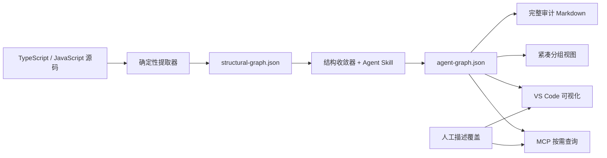

# VibeKnowledge

[English](./README.md) | 简体中文

VibeKnowledge 是一个提供本地 Agent Skills 和可选 MCP 接入的 VS Code 扩展，用来把 TypeScript/JavaScript 工程转换成适合 Coding Agent 按需查询的紧凑知识图谱。

项目把代码事实、精选视图和人工描述分开管理：确定性提取器负责图谱结构，内置 Agent Skill 生成聚焦的框架层和功能分组，人工只维护描述，不必手工创建节点或关系。

## 为什么需要它

把整个仓库或一份大型生成报告直接交给 Agent，会在任务开始前占用大量上下文。VibeKnowledge 先提供很小的路由索引，再让 Agent 只查询当前任务需要的分组、邻域、影响路径和源码文件。



## 实测上下文节省

### 0.5.0：按功能查询 Skill 的结果

当前结论来自两个 VibeKnowledge 功能分析任务的三组独立 A/B：**实际工具文本减少 24.4%**，**未缓存输入加输出减少 21.9%**，每组双方均为 **17/17 关键项**。通过的是复用效率门槛，不是准确率提升门槛。两份简报生成另耗 **90,480 个未缓存输入加输出 token**，首次使用不省净 token。原始数据、早期失败试验及适用边界见[评测索引](./evaluation/query-skill/README.md)和[完整报告](./evaluation/query-skill/context/r3/results.md)。

### 历史固定检索对比（不是完整 Agent 任务用量）

Phase 7 使用 `nestjs-realworld-example-app` 的 5 个固定 Coding Agent 任务，覆盖功能定位、补充测试、修改 API、影响分析和依赖环追踪。

在推荐的 600-token MCP 查询预算下：

| 检索方式 | 平均输入 token | 证据覆盖率代理 | 读取文件 | 工具调用 |
| --- | ---: | ---: | ---: | ---: |
| 不使用图谱，只搜索源码 | 2,783 | 85.6% | 5.0 | 6.0 |
| 加载紧凑 Markdown 分组 | 2,426 | 72.6% | 4.8 | 6.8 |
| MCP 按需查询图谱 | 1,710 | 90.3% | 3.6 | 4.6 |

MCP 每个任务平均少使用 **1,073 个估算输入 token**，相对纯源码检索降低 **38.6%**，证据覆盖率代理同时提高 4.8 个百分点。相对加载紧凑 Markdown 分组，输入 token 降低 29.5%。MCP 平均返回 411 token，相比注入完整的 10,679-token 审计报告减少 96.2%。

这些数字是可复现的保守估算，不是模型供应商的实际计费数据；证据覆盖率衡量检索质量，不等于最终回答质量。完整方法和逐任务结果见 [Phase 7 评测报告](./evaluation/phase7/results.md)。

### 查询 Skill 与 MCP 的对比

**vibeknowledge-query** 复用 MCP 查询算法，但不启动服务器。最初版本在 NestJS 隔离样例上的 9 个配对查询中，双方输出**逐字一致**，因此查询结果本身节省 **0% token**。把当时的说明加载一次、用户问题、结果和调用参数计入，Skill 为 **5,265** token；MCP 加载全部 10 个工具定义时为 **6,101**（Skill 少 **13.7%**），只加载依赖工具时为 **5,962**（少 **11.7%**）。双方都无需重新加载说明的热会话中，Skill 为 4,083，MCP 为 3,907；CLI 参数更长，反而多 **4.5%**。这些是该版本的历史计数，不是后续 Skill 文案修改后的重新测量。

这是 `o200k_base` 文本计数，不是计费遥测或完整 Agent 编码评测；客户端按需发现、缓存与后续源码读取都会影响实际结果。详见 [评测方法、逐项数据与限制](./evaluation/query-skill/results.md) 和 [独立 Skill 试用记录](./evaluation/query-skill/agent-trial.md)。主要收益是无需安装 MCP 即可按需查询，不能承诺任何场景都更省 token。

### 查询 Skill 与不用 Skill 的真实 A/B

两个无历史继承、相同模型/推理档位的独立 Agent 完成相同的标签修改与 ORM 关系分析任务，两侧均通过 6 项单测和 6 项独立验收。此次 Skill 侧工具文本为 **8,766** token，源码检索侧为 **7,315**（Skill 多 **19.8%**）；含缓存重放的模型累计总 token 多 **67.0%**。因此不能把上面的固定检索收益直接当作完整 Agent 任务收益。单对试验、缓存分项、反向回归验证及限制见 [独立 A/B 报告](./evaluation/query-skill/ab/results.md)。

当前 Skill 已改为选择性查询：明确文件和局部任务可以直接查源码，只有不明确的跨文件依赖才考虑图谱，不再自动先调用 overview。[第二轮新 A/B](./evaluation/query-skill/ab/selective-results.md) 中 B 实际查询图谱 **0 次**，但工具文本仍比 A 多 **39.2%**（9,534 对 6,847），没有观察到净收益。本轮先加载规则再决定是否查询，未验证在发现阶段完全不加载 Skill 的效果。

后续[任务上下文试验](./evaluation/query-skill/context/pilot-r1/summary.md)使工具文本减少 **10.8%**，但未缓存输入加输出增加 **3.1%**。三组[按功能读取的独立复测](./evaluation/query-skill/context/heldout-results.md)中，实际工具文本中位数少 **14.3%**，未缓存输入加输出少 **8.2%**；固定评分下无退步，仅一组完整度略有提升，未通过预设门槛。前期功能简报试验曾漏掉关键内容；生成四份简报另耗 **110,080** 未缓存输入加输出 token。这些未达标结果继续保留。

最新版在新任务的三组[独立 A/B 中通过了省 token 门槛](./evaluation/query-skill/context/r3/results.md)：分析 VibeKnowledge 源码快照中的图谱页面交互与 Copilot 文档生成，实际工具文本中位数少 **24.4%**（74,789 → 56,572），未缓存输入加输出少 **21.9%**（104,756 → 81,771）；每组双方均为 **17/17 关键项**，无重大错误。这是限定场景下复用简报的收益，不是准确率提升。两份简报生成另耗 **90,480** 未缓存输入加输出 token，首次使用不省净 token。B 使用了功能简报，未调用图谱路径分析；尚未对比等价人工文档或其他仓库。缓存、生成成本、逐任务阅读量及评分限制见完整报告。

## 图谱模型

VibeKnowledge 生成两层图谱：

- `structural-graph.json` 保存确定性的源码事实、位置、诊断和结构路径，不会整份注入 Agent 上下文。
- `agent-graph.json` 保存从结构事实中精选出的独立 version-1 分组。生成器输出的 key、类型、路径和关系是唯一结构来源。

默认的 `framework` 分组是一张系统边界图，只保留启动链路、根模块、顶层业务模块、跨模块直接依赖、共享基础设施和外部系统。

模块或功能详细分组保留组件级的 Module、API、Service、Entity、DTO、接口和一跳直接依赖。方法、构造器和测试会折叠到所属组件；每一对有向实体之间只保留最有价值的一条关系。

支持的实体类型：

```text
function  class  interface  variable  file  api  service  component  external
```

支持的关系：

```text
calls  extends  implements  depends_on  contains  references  imports  exports
```

系统不再维护手工结构图谱。重新生成时，Skill 没有生成的旧节点和关系会被丢弃。人工只修改描述，稳定实体 key 会在重新生成后把描述覆盖重新关联到对应实体。

## 生成文件

```text
<workspace>/.vscode/.knowledge/
  structural-graph.json             确定性源码事实
  structural-graph.previous.json    上一个有效结构快照
  cache/structural/index.json       增量提取缓存
  agent-graph.json                  分组精选图谱
  knowledge-graph.md                完整人工审计报告
  agent-context/index.md            Agent 使用的小型路由索引
  agent-context/<group-key>.md      实体、路径和关系紧凑视图
  graph.sqlite                      人工描述和可选 RAG 数据
```

`knowledge-graph.md` 只用于人工审计，不应该放进默认 Agent instructions。Agent 可以通过本地查询 Skill 或 MCP 按需检索；仅使用文件导航时，先读取 `agent-context/index.md`，再选择一个相关分组。

## 快速开始

### 从源码运行扩展

项目默认版本和两个 CI 任务统一使用 Node.js **26.1.0**，由根目录 `.nvmrc` 固定。包的兼容范围为 `>=26.1.0 <27`，允许本机使用 26.8.1。版本文件不会自动修改系统 Node；需要复现 CI 时，通过版本管理器选择 26.1.0。VS Code 要求 1.80 或更高版本，其扩展宿主运行时由 VS Code 管理，不受 `.nvmrc` 控制。

```bash
git clone https://github.com/davexxx1214/VibeKnowledge.git
cd VibeKnowledge
npm ci
npm run compile
code .
```

按 `F5` 并选择 **Run Extension**。在 Extension Development Host 中打开目标工程，然后从命令面板运行 **Knowledge: Install Dependency Graph Agent Skill**。

Windows 下，本仓库的构建/监听任务明确使用 `cmd.exe` 和 `npm.cmd`，F5 的构建步骤不依赖 PowerShell 终端配置。这不会修改系统执行策略或目标工程的终端设置。如果目标窗口仍启动 PowerShell，请检查该窗口恢复的终端，并通过 **Terminal: Select Default Profile** 选择公司允许的 **Command Prompt**。参见 [VS Code 终端配置说明](https://code.visualstudio.com/docs/terminal/profiles)。

### 不使用 MCP 查询依赖

在目标工程运行 **Knowledge: Install Graph Query Agent Skill**，然后向 Agent 提问：

```text
$vibeknowledge-query 分析 GET /tags 的文件依赖，以及增加标签排序需要修改的位置和测试。
```

命令会把完整 Skill 安装到 `.agents/skills/vibeknowledge-query`。本机需要 **Node >=26.1 <27**；图谱查询需要已有图谱，简报查询只需要已发布的简报及引用源码。无需用户运行 npm 安装、配置 MCP 或填写 API Key。脚本只读查询；精选图查询在存在 `graph.sqlite` 时通过 Node 内置 SQLite 读取人工描述，简报不读取数据库。不包含 RAG 问答或观察记录检索。使用前应确认公司允许本地 Skill/脚本执行和相关数据访问。

已知文件的小任务可以直接读源码。分析指定页面/功能时，先用 `features --query <名称>` 找到简报，再用 `brief --feature <key>` 获取职责、入口、主要依赖及其作用、相关框架、测试与有源码依据的限制。简报在请求分析该功能时生成，不默认遍历所有页面。只有选中的简报进入上下文，只校验其引用文件；文件变化或不可读时不输出旧事实。新增调用方、未引用文件和运行时行为仍未认证，修改相关行为前需要核实源码。

没有简报或需要更广影响分析时，再使用 `context --selector <文件或符号>` 获取依赖路径、源码位置、图谱关联测试候选、已索引文件哈希检查与解析诊断。不会自动读取概览或整份图谱。文件级路径不是执行轨迹，测试候选不代表覆盖率。详见[简报生成与刷新约定](resources/skills/vibeknowledge-dependency-graph/references/feature-briefs.md)。

例如，首次请生成 Skill「为帮助文档页生成独立功能分组和功能简报，记录实际入口、主要功能、直接依赖/消费者、相关框架、测试及有源码依据的限制」。后续请查询 Skill「分析帮助文档页，先读取该功能简报，只对缺失或需要核实的部分展开源码」。框架边界图保留系统级视角，不承载每个页面的细节。简报预算优先覆盖不同类别；被省略的事实类别会明确提示，不能把未显示的测试当作不存在。

开发者可运行 `node scripts/build-query-skill.cjs` 构建发布包（`npm run compile` 也会执行）；可独立复制的是 `dist/skills/vibeknowledge-query` 整个目录，而不是 `resources` 下只有说明的源码目录。[最新独立评测](./evaluation/query-skill/context/r3/results.md)在两个功能分析任务上通过了[预先固定的](./evaluation/query-skill/context/protocol.md)复用效率门槛，未证明准确率提升。简报生成/刷新成本与复用成本分开统计；明确文件的小任务仍可直接读源码，避免加载 Skill 的开销。

### 使用 Skill 生成图谱

向支持 Agent Skills 的 Coding Agent 发出请求：

```text
$vibeknowledge-dependency-graph 生成框架层知识图谱
```

也可以直接运行同一套确定性流程：

```bash
node .agents/skills/vibeknowledge-dependency-graph/scripts/extract-structural-graph.mjs --workspace . --scope .
node .agents/skills/vibeknowledge-dependency-graph/scripts/validate-structural-graph.mjs .vscode/.knowledge/structural-graph.json .
node .agents/skills/vibeknowledge-dependency-graph/scripts/curate-structural-graph.mjs --workspace . --kind framework --name "框架层"
```

增加或刷新详细分组时，不会替换其他分组：

```bash
node .agents/skills/vibeknowledge-dependency-graph/scripts/curate-structural-graph.mjs --workspace . --kind feature --scope src/article --key article-management --name "文章管理"
```

提取过程支持增量更新：复用未变化文件的结果，只重新解析变更文件和反向 importer。输出通过校验后才会原子替换；如果结果损坏、出现新的语法错误或异常缩小，会保留上一个有效版本供人工检查。

### 查看图谱和编辑描述

运行 **Knowledge: Visualize Graph**，从左侧选择一个分组。Webview 只渲染当前分组；具有源码位置的节点可以跳转到代码，原始邻域和结构路径只在请求时加载。

默认使用 **低性能模式**。在图谱右上角可切换为 **高性能模式**，开启粒子、流动连线、发光和拖动时的力导向布局。选择会保存在本机设置 `knowledgeGraph.visualization.performanceMode`（`low` / `high`）中，也可以在 VS Code 设置中修改。

低性能模式分批计算有预算上限的静态布局，缓存最近分组的位置和缩放；拖动时只重画当前节点及相连的边。两种模式都会在视图隐藏时暂停动画和布局计算。所有节点、关系、提示和代码跳转仍然保留；模式不会改变生成文件、MCP 结果或后台源码提取。大型图谱和源码分析的开销仍可能需要进一步优化。

源码上方的 `🧠 KG` CodeLens 会显示实体当前描述。人工修改后，这份描述会覆盖所有分组中的生成文本，直到运行 **Knowledge: Restore Agent Description**。

## MCP Server

扩展构建现已先执行 `tsc --noEmit` 严格类型检查，再打包。MCP 源码构建会先校验本地 TypeScript 和 SDK 声明文件，避免声明缺失后产生大量隐式 `any` 错误；不会通过关闭 `strict` 或增加无类型的 `declare module` 绕过检查。

打开 **Knowledge: Settings → 一键安装 / 重新配置 MCP**，或点击 Knowledge Explorer 上的插头按钮，选择目标工程并确认安装。F5 和 VSIX 安装均可用，不需要用户输入命令或运行 TypeScript build。

`knowledgeGraph.mcp` 下提供以下设置：

| 设置 | 用途 |
| --- | --- |
| `workspacePath` | 目标业务工程的绝对路径；留空时选择目录，不是 VibeKnowledge 源码目录。 |
| `nodePath` | 外部 Node 可执行文件，默认 `node`，支持 `>=26.1.0 <27`。 |
| `npmCliPath` | 可选；非标准安装可填写 `npm-cli.js` 的绝对路径。 |
| `auditTimeoutSeconds` | 单次审计请求超时，默认 60 秒，可设为 10–120 秒。 |
| `client` | `auto` 自动识别当前编辑器，或指定 `vscode` / `cursor`。 |

扩展内置预编译 MCP 和锁文件，依赖安装到扩展独立存储目录，不动业务工程的 `node_modules`。安装时启用审计、禁用依赖安装生命周期脚本，并验证原生 SQLite、MCP 握手和工具；全部通过后才备份配置并更新 `vibeknowledge`，保留其他 MCP 和 JSONC 注释。失败不会替换旧配置；之前成功安装的运行目录会保留，避免影响仍在运行的客户端。直接使用外部 Node，不调用 PowerShell 或本地 C++ 编译，也不修改公司源、证书或脚本策略。

完成后在客户端确认信任并启动/重启服务。默认配置为纯图谱查询（`--rag-mode none`），RAG 可另行开启。首次使用会初始化缺失的 SQLite 数据库，但不会生成或刷新知识图谱，图谱仍由 Skill 生成。目标路径保存在本机设置中；切换工程时修改或清空 `workspacePath`。

MCP 已升级到 `better-sqlite3` 13：支持平台的 N-API 预编译文件随 npm 包提供，不再通过 `prebuild-install` 另行下载按 Node ABI 区分的 SQLite 文件。更新扩展后，已有 MCP 用户需再次执行**一键安装 / 重新配置 MCP**并重启客户端，才能切换到新版隔离运行目录；不要跨操作系统或 CPU 架构复制 `node_modules`。

MCP 子项目的 `.npmrc` 默认禁用依赖安装生命周期脚本，避免 [npm 锁文件安装缺陷](https://github.com/WiseLibs/better-sqlite3/issues/1516)在已有预编译文件时仍触发 `node-gyp`；一键安装也会显式应用这一设置，审计保持开启。根项目开发依赖不受影响。运行平台必须受预编译包支持，安装器不会静默回退到源码编译。

仅在**开发独立 MCP 源码**时，仍可手动安装与构建：

```bash
cd packages/mcp-server
npm ci --include=dev
npm run audit:dependencies
npm run build
node dist/index.js --workspace /path/to/project
```

MCP 提供紧凑的实体与关系查询，以及结构环、耦合、边界、差异、影响、社区建议和最短路径分析。查询输出受 token budget 限制；图谱新鲜度校验失败时可以回退到源码搜索。

Cursor 和 GitHub Copilot 的配置示例见 [MCP 使用指南](./MCP_USAGE.md)。

MCP 包是独立 npm 项目，不是 npm workspace。在仓库根目录使用 `npm --prefix packages/mcp-server ci` 和 `npm --prefix packages/mcp-server run build`。VS Code 的 `.vscode/mcp.json` 使用 `servers`，Cursor 的 `.cursor/mcp.json` 使用 `mcpServers`。入口需指向当前仓库，安装原生依赖的 Node.js 必须与 MCP 客户端使用的运行时兼容。关系列表工具名为 `list_relations`。

两个 npm 项目及 CI 均启用审计。CI 在 Node 26.1.0 上固定 npm 11.19.0。`npm run audit:dependencies` 检查生产依赖：单次请求默认等待 60 秒，最多尝试三次，重试前分别等待 2 秒、4 秒；高危/严重漏洞、证书或权限错误及已识别的本地输入错误立即阻断。审计失败后输出当前 npm 源及 `npm ping` 诊断，连通性正常不会被当作审计通过。无需添加 `--no-audit`。公司 npm 源、代理和 CA 配置需允许安装依赖及访问 Bulk Advisory 接口；延长等待无法修复不可用的服务。

一键安装可在 **Knowledge: Settings → MCP 设置 → Audit Timeout Seconds** 调整超时。命令行和 CI 可设置环境变量 `VIBEKNOWLEDGE_AUDIT_TIMEOUT_MS`，范围 `10000`–`120000`，默认 `60000`；一键安装以 UI 设置为准。日志用 `AUDIT_VULNERABILITIES`（退出码 1）区分漏洞、`AUDIT_UNAVAILABLE`（退出码 2）区分未获得有效审计结果；超时配置不合法时退出码为 3，均阻断安装/CI。每次 npm 进程另有 15 秒余量，失败后的连通性诊断也有时间上限；取消安装仍会终止整个安装进程树。

依赖弃用警告处理结果（核对日期：2026-09-04）：

| 依赖链 | 处理结果 |
| --- | --- |
| `vsce → cheerio → encoding-sniffer` | 仅对这条开发依赖链定向覆盖为 `encoding-sniffer` 1.0.2，移除 `whatwg-encoding`。已在 Node 26 验证 CommonJS 加载、多种编码、分块流解析及 VSIX 打包；待 Cheerio 正式采用新版后复查并移除覆盖。 |
| `vsce → keytar → prebuild-install` | 保留：vsce 3.9.2、keytar 7.9.0、prebuild-install 7.1.3 已是各自最新发布版。MCP 已不再使用该安装器。 |
| `Google SDK → … → fetch-blob → node-domexception` | 保留 1.0.0：2.0.2 同样弃用，且不再导出 fetch-blob 需要的构造函数。隔离升级复现 `DOMException is not a constructor` 后已撤回；单独升级 Google SDK 无法移除此依赖链。 |

## 可选 RAG

工作区 `Knowledge/` 目录下的文档可以通过 Gemini File Search 或配置好的 OpenAI 兼容接口建立索引。云端模式会把文档上传到 Gemini；本地模式把分块和向量保存在 `graph.sqlite`，但嵌入与推理请求仍会发送到配置的接口。索引私有资料前应先检查接口的数据政策，也不要提交 API Key。

相关配置：

| 设置 | 默认值 |
| --- | --- |
| `knowledgeGraph.rag.mode` | `cloud` |
| `knowledgeGraph.gemini.apiKey` | 空 |
| `knowledgeGraph.rag.local.apiBase` | `http://localhost:8000/v1` |
| `knowledgeGraph.rag.local.embeddingModel` | `text-embedding-3-small` |
| `knowledgeGraph.rag.local.inferenceModel` | `gpt-4.1` |

## 开发

| 命令 | 用途 |
| --- | --- |
| `npm run compile` | 将扩展打包到 `dist/extension.js`。 |
| `npm run watch` | 源文件变化后持续构建。 |
| `npm run lint` | 使用 `eslint.config.cjs` 原生 flat config 运行 ESLint 10。 |
| `npm test` | 运行根目录 Vitest 测试。 |
| `npm run check` | 编译、lint 并测试。 |
| `npm run test:coverage` | 生成 V8 覆盖率。 |
| `npm run package` | 构建 VSIX。 |

MCP 包有独立的构建和测试命令：

```bash
cd packages/mcp-server
npm run build
npm test
```

仓库结构：

```text
src/                         VS Code 扩展
packages/mcp-server/         独立 MCP Server
resources/skills/            可安装的 Agent Skill
resources/scenarios/         可选 AI 任务场景
evaluation/phase7/           检索评测与结果
```

## 文档

- [图谱 Schema](./resources/skills/vibeknowledge-dependency-graph/references/graph-schema.md)
- [MCP 使用指南](./MCP_USAGE.md)
- [项目结构](./project_structure.md)
- [贡献指南](./CONTRIBUTING.md)
- [安全策略](./SECURITY.md)
- [更新记录](./CHANGELOG.md)

## License

[MIT](./LICENSE)
