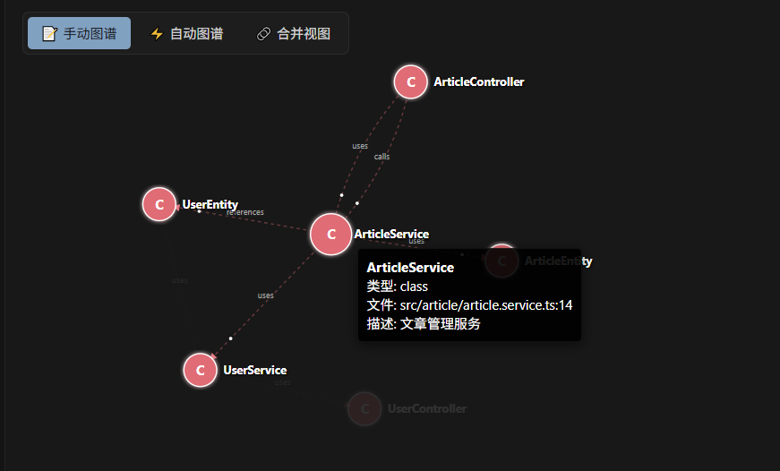
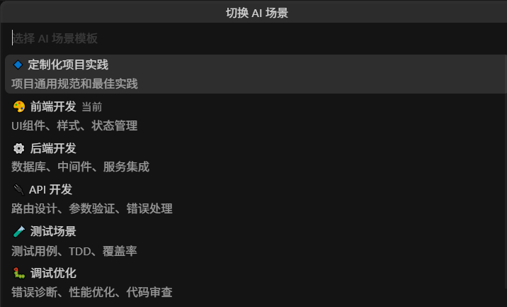

# VibeKnowledge

[English](./README.md) | 简体中文

VibeKnowledge 是一个 VS Code 插件，用来维护与代码一起演进的项目知识图谱。它把代码实体、关系和维护笔记存进工作区内的 SQLite 数据库，再通过 VS Code、AI 配置文件和可选的 MCP Server 提供给开发者与 AI 工具。

VibeKnowledge 以源码形式提供。你可以 Fork 本仓库进行定制、本地运行，或自行打包 VSIX 使用。

## 演示

https://github.com/user-attachments/assets/33b3774a-a142-4cbb-93cc-6768732e0723

| 知识图谱 | AI 场景选择 |
| --- | --- |
|  |  |

## 主要功能

| 模块 | 当前能力 |
| --- | --- |
| 知识图谱 | 在同一张图谱中查看和编辑人工数据与 Agent 生成的实体、依赖关系和证据。 |
| Agent 生成 | 安装项目级 Agent Skill，让 Agent 先语义阅读代码并生成图谱；人工随后可以补充实体、关系、观察记录和描述。 |
| 图谱可视化 | 在统一的 `vis-network` Webview 中查看完整图谱，并跳回源码位置。 |
| AI 上下文 | 导出 Markdown 或 JSON，生成 Cursor 规则和 GitHub Copilot 指令，并切换内置任务场景。 |
| RAG | 通过 Gemini File Search 或 OpenAI 兼容接口索引文档，在 VS Code 侧边栏中提问。 |
| MCP Server | 让 Cursor、GitHub Copilot 或其他 MCP 客户端查询同一份统一知识图谱。 |
| 图谱音乐 | 根据图谱结构生成 Strudel 乐谱，并在内嵌播放器中打开。这个功能仍在实验阶段。 |

项目数据保存在：

```text
<workspace>/.vscode/.knowledge/graph.sqlite
<workspace>/.vscode/.knowledge/agent-graph.json
```

`agent-graph.json` 是可重复生成的结构层；`graph.sqlite` 保存人工实体、关系、观察记录，以及 Agent 实体的人工描述覆盖。扩展把它们读取成同一张知识图谱。人工描述始终优先，因此 Agent 再次生成时不会覆盖已经编辑的描述。

## 从源码运行

### 环境要求

- 开发环境建议用 Node.js 20。
- VS Code 1.80 或更高版本。

### 安装

```bash
git clone https://github.com/davexxx1214/VibeKnowledge.git
cd VibeKnowledge
npm ci
npm run compile
code .
```

在 VS Code 中按 `F5`，选择 **Run Extension**。Extension Development Host 启动后打开目标项目，在命令面板中运行 **Knowledge: Install Dependency Graph Agent Skill**。

开发时可以持续构建：

```bash
npm run watch
```

## 常用工作流

### 编辑知识图谱

1. 在编辑器中选中一段代码。
2. 从右键菜单或命令面板运行 **Knowledge: Create Entity from Selection**。
3. 在 VibeKnowledge 侧边栏中添加关系和观察记录，或右键实体选择 **Knowledge: Edit Entity Description** 编辑描述。
4. 运行 **Knowledge: Visualize Graph** 查看图谱。

手动观察记录适合保存静态分析拿不到的信息，比如架构决策、已知风险、迁移说明和重构约束。

### 让 Agent 生成依赖图谱

1. 运行 **Knowledge: Install Dependency Graph Agent Skill**。扩展会把 Skill 安装到项目的 `.agents/skills/vibeknowledge-dependency-graph/`。
2. 在支持 Agent Skills 的编码 Agent 中提出“生成/更新项目依赖图谱”，或显式调用 `$vibeknowledge-dependency-graph`。
3. Agent 会阅读代码，以稳定实体键、明确关系方向和文件行号证据生成 `.vscode/.knowledge/agent-graph.json`，并运行 Skill 自带的校验器。
4. 扩展监听该文件；保存后侧边栏、编辑器中的 `🧠 KG` 提示与已打开的图谱视图都会自动刷新。

Agent 生成层使用完整替换语义，因此再次运行 Skill 会清理已经不存在的生成关系。它不会修改 `graph.sqlite`；人工实体、关系、观察记录和描述覆盖都会保留。实体的稳定 `key` 用于重新关联人工描述。清单格式见 [生成层 schema](./resources/skills/vibeknowledge-dependency-graph/references/graph-schema.md)。

具有源码位置的 Agent 实体会在对应代码上方显示当前描述，例如 `🧠 KG: 负责用户认证……`。点击提示即可人工编辑；Agent 后续运行 Skill 时也可以更新生成描述。一旦人工编辑，人工覆盖优先，直到在实体菜单中执行 **Knowledge: Restore Agent Description** 恢复使用 Agent 描述。

### 使用 RAG

在项目根目录创建 `Knowledge/` 文件夹，把需要索引的文档放进去，然后在 VS Code 设置中选择 RAG 模式：

| 设置 | 默认值 | 用途 |
| --- | --- | --- |
| `knowledgeGraph.rag.mode` | `cloud` | 选择 Gemini File Search 或配置好的 OpenAI 兼容接口。 |
| `knowledgeGraph.gemini.apiKey` | 空 | 启用 Gemini 云端 RAG。 |
| `knowledgeGraph.rag.local.apiBase` | `http://localhost:8000/v1` | 设置本地模式调用的嵌入与推理接口。 |
| `knowledgeGraph.rag.local.embeddingModel` | `text-embedding-3-small` | 选择接口提供的嵌入模型。 |
| `knowledgeGraph.rag.local.inferenceModel` | `gpt-4.1` | 选择接口提供的推理模型。 |

云端模式会把索引文档上传到 Gemini File Search。本地模式把文档分块和向量保存在工作区数据库中，但嵌入和推理请求仍会发送到你配置的接口。索引私有资料前，需要先确认该接口的数据处理方式，也不要把 API Key 提交到仓库。

### 连接 MCP Server

MCP 包位于 [`packages/mcp-server`](./packages/mcp-server)。在当前仓库中构建并运行：

```bash
cd packages/mcp-server
npm ci
npm run build
node dist/index.js --workspace /path/to/your/project
```

目标工作区中需要已有 VibeKnowledge 数据库。先在该工作区运行一次 VS Code 插件，再启动 Server。运行 `node dist/index.js --help` 可以查看数据库路径和 RAG 参数，Cursor 与 GitHub Copilot 的配置示例见 [MCP 使用指南](./MCP_USAGE.md)。

## 开发

### 常用命令

| 命令 | 用途 |
| --- | --- |
| `npm run compile` | 把插件打包到 `dist/extension.js`。 |
| `npm run watch` | 源文件变化后重新构建。 |
| `npm run lint` | 对 TypeScript 源码运行 ESLint。 |
| `npm run check` | 编译、lint 并运行根目录测试。 |
| `npm run package` | 使用 `@vscode/vsce` 构建 VSIX。 |
| `npm test` | 运行根目录的 Vitest 测试。 |
| `npm run test:coverage` | 运行测试并生成 V8 覆盖率。 |

MCP Server 有独立的依赖和脚本：

```bash
cd packages/mcp-server
npm ci
npm run build
npm test
```

### 仓库结构

```text
src/
  commands/              AI 场景命令
  i18n/                  中英文界面文本
  providers/             VS Code 树视图、悬浮提示和 CodeLens
  services/              统一知识图谱、Agent 生成层、RAG 和导出服务
  ui/                    命令处理与 Webview
packages/mcp-server/     独立 MCP Server
resources/scenarios/     内置 AI 任务模板
resources/skills/        可安装的项目级 Agent Skills
presentation/            演示素材
```

## 其他文档

- [English demo guide](./Demo_en.md)
- [中文演示指南](./Demo.md)
- [English project structure](./project_structure_en.md)
- [中文项目结构](./project_structure.md)
- [MCP 使用指南](./MCP_USAGE.md)
- [贡献指南](./CONTRIBUTING.md)
- [安全策略](./SECURITY.md)
- [变更日志](./CHANGELOG.md)

欢迎提交 issue 和 pull request。改动范围较大时，可以先开 issue 讨论功能行为和数据格式，再开始实现。

## 许可证

VibeKnowledge 使用 [MIT License](./LICENSE)。
