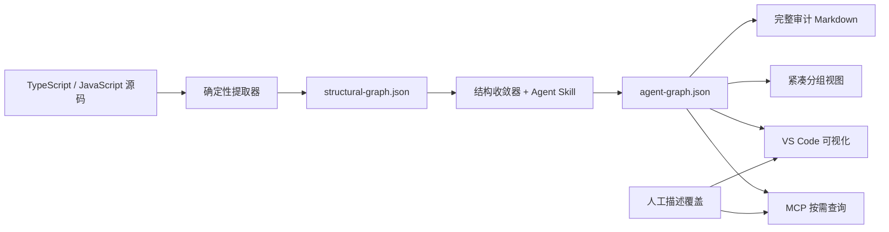

# VibeKnowledge

[English](./README.md) | 简体中文

VibeKnowledge 是一个 VS Code 扩展和本地 MCP Server，用来把 TypeScript/JavaScript 工程转换成适合 Coding Agent 按需查询的紧凑知识图谱。

项目把代码事实、精选视图和人工描述分开管理：确定性提取器负责图谱结构，内置 Agent Skill 生成聚焦的框架层和功能分组，人工只维护描述，不必手工创建节点或关系。

## 为什么需要它

把整个仓库或一份大型生成报告直接交给 Agent，会在任务开始前占用大量上下文。VibeKnowledge 先提供很小的路由索引，再让 Agent 只查询当前任务需要的分组、邻域、影响路径和源码文件。



## 实测上下文节省

Phase 7 使用 `nestjs-realworld-example-app` 的 5 个固定 Coding Agent 任务，覆盖功能定位、补充测试、修改 API、影响分析和依赖环追踪。

在推荐的 600-token MCP 查询预算下：

| 检索方式 | 平均输入 token | 证据覆盖率代理 | 读取文件 | 工具调用 |
| --- | ---: | ---: | ---: | ---: |
| 不使用图谱，只搜索源码 | 2,783 | 85.6% | 5.0 | 6.0 |
| 加载紧凑 Markdown 分组 | 2,426 | 72.6% | 4.8 | 6.8 |
| MCP 按需查询图谱 | 1,710 | 90.3% | 3.6 | 4.6 |

MCP 每个任务平均少使用 **1,073 个估算输入 token**，相对纯源码检索降低 **38.6%**，证据覆盖率代理同时提高 4.8 个百分点。相对加载紧凑 Markdown 分组，输入 token 降低 29.5%。MCP 平均返回 411 token，相比注入完整的 10,679-token 审计报告减少 96.2%。

这些数字是可复现的保守估算，不是模型供应商的实际计费数据；证据覆盖率衡量检索质量，不等于最终回答质量。完整方法和逐任务结果见 [Phase 7 评测报告](./evaluation/phase7/results.md)。

## 图谱模型

VibeKnowledge 生成两层图谱：

- `structural-graph.json` 保存确定性的源码事实、位置、诊断和结构路径，不会整份注入 Agent 上下文。
- `agent-graph.json` 保存从结构事实中精选出的独立 version-1 分组。生成器输出的 key、类型、路径和关系是唯一结构来源。

默认的 `framework` 分组是一张系统边界图，只保留启动链路、根模块、顶层业务模块、跨模块直接依赖、共享基础设施和外部系统。

模块或功能详细分组保留组件级的 Module、API、Service、Entity、DTO、接口和一跳直接依赖。方法、构造器和测试会折叠到所属组件；每一对有向实体之间只保留最有价值的一条关系。

支持的实体类型：

```text
function  class  interface  variable  file  api  service  component  external
```

支持的关系：

```text
calls  extends  implements  depends_on  contains  references  imports  exports
```

系统不再维护手工结构图谱。重新生成时，Skill 没有生成的旧节点和关系会被丢弃。人工只修改描述，稳定实体 key 会在重新生成后把描述覆盖重新关联到对应实体。

## 生成文件

```text
<workspace>/.vscode/.knowledge/
  structural-graph.json             确定性源码事实
  structural-graph.previous.json    上一个有效结构快照
  cache/structural/index.json       增量提取缓存
  agent-graph.json                  分组精选图谱
  knowledge-graph.md                完整人工审计报告
  agent-context/index.md            Agent 使用的小型路由索引
  agent-context/<group-key>.md      实体、路径和关系紧凑视图
  graph.sqlite                      人工描述和可选 RAG 数据
```

`knowledge-graph.md` 只用于人工审计，不应该放进默认 Agent instructions。Agent 应先读取 `agent-context/index.md`，选择一个相关分组，再按需查看源码或查询 MCP。

## 快速开始

### 从源码运行扩展

项目默认版本和两个 CI 任务统一使用 Node.js **26.1.0**，由根目录 `.nvmrc` 固定。包的兼容范围为 `>=26.1.0 <27`，允许本机使用 26.8.1。版本文件不会自动修改系统 Node；需要复现 CI 时，通过版本管理器选择 26.1.0。VS Code 要求 1.80 或更高版本，其扩展宿主运行时由 VS Code 管理，不受 `.nvmrc` 控制。

```bash
git clone https://github.com/davexxx1214/VibeKnowledge.git
cd VibeKnowledge
npm ci
npm run compile
code .
```

按 `F5` 并选择 **Run Extension**。在 Extension Development Host 中打开目标工程，然后从命令面板运行 **Knowledge: Install Dependency Graph Agent Skill**。

Windows 下，本仓库的构建/监听任务明确使用 `cmd.exe` 和 `npm.cmd`，F5 的构建步骤不依赖 PowerShell 终端配置。这不会修改系统执行策略或目标工程的终端设置。如果目标窗口仍启动 PowerShell，请检查该窗口恢复的终端，并通过 **Terminal: Select Default Profile** 选择公司允许的 **Command Prompt**。参见 [VS Code 终端配置说明](https://code.visualstudio.com/docs/terminal/profiles)。

### 使用 Skill 生成图谱

向支持 Agent Skills 的 Coding Agent 发出请求：

```text
$vibeknowledge-dependency-graph 生成框架层知识图谱
```

也可以直接运行同一套确定性流程：

```bash
node .agents/skills/vibeknowledge-dependency-graph/scripts/extract-structural-graph.mjs --workspace . --scope .
node .agents/skills/vibeknowledge-dependency-graph/scripts/validate-structural-graph.mjs .vscode/.knowledge/structural-graph.json .
node .agents/skills/vibeknowledge-dependency-graph/scripts/curate-structural-graph.mjs --workspace . --kind framework --name "框架层"
```

增加或刷新详细分组时，不会替换其他分组：

```bash
node .agents/skills/vibeknowledge-dependency-graph/scripts/curate-structural-graph.mjs --workspace . --kind feature --scope src/article --key article-management --name "文章管理"
```

提取过程支持增量更新：复用未变化文件的结果，只重新解析变更文件和反向 importer。输出通过校验后才会原子替换；如果结果损坏、出现新的语法错误或异常缩小，会保留上一个有效版本供人工检查。

### 查看图谱和编辑描述

运行 **Knowledge: Visualize Graph**，从左侧选择一个分组。Webview 只渲染当前分组；具有源码位置的节点可以跳转到代码，原始邻域和结构路径只在请求时加载。

默认使用 **低性能模式**。在图谱右上角可切换为 **高性能模式**，开启粒子、流动连线、发光和拖动时的力导向布局。选择会保存在本机设置 `knowledgeGraph.visualization.performanceMode`（`low` / `high`）中，也可以在 VS Code 设置中修改。

低性能模式分批计算有预算上限的静态布局，缓存最近分组的位置和缩放；拖动时只重画当前节点及相连的边。两种模式都会在视图隐藏时暂停动画和布局计算。所有节点、关系、提示和代码跳转仍然保留；模式不会改变生成文件、MCP 结果或后台源码提取。大型图谱和源码分析的开销仍可能需要进一步优化。

源码上方的 `🧠 KG` CodeLens 会显示实体当前描述。人工修改后，这份描述会覆盖所有分组中的生成文本，直到运行 **Knowledge: Restore Agent Description**。

## MCP Server

扩展构建现已先执行 `tsc --noEmit` 严格类型检查，再打包。MCP 源码构建会先校验本地 TypeScript 和 SDK 声明文件，避免声明缺失后产生大量隐式 `any` 错误；不会通过关闭 `strict` 或增加无类型的 `declare module` 绕过检查。

打开 **Knowledge: Settings → 一键安装 / 重新配置 MCP**，或点击 Knowledge Explorer 上的插头按钮，选择目标工程并确认安装。F5 和 VSIX 安装均可用，不需要用户输入命令或运行 TypeScript build。

`knowledgeGraph.mcp` 下提供以下设置：

| 设置 | 用途 |
| --- | --- |
| `workspacePath` | 目标业务工程的绝对路径；留空时选择目录，不是 VibeKnowledge 源码目录。 |
| `nodePath` | 外部 Node 可执行文件，默认 `node`，支持 `>=26.1.0 <27`。 |
| `npmCliPath` | 可选；非标准安装可填写 `npm-cli.js` 的绝对路径。 |
| `client` | `auto` 自动识别当前编辑器，或指定 `vscode` / `cursor`。 |

扩展内置预编译 MCP 和锁文件，依赖安装到扩展独立存储目录，不动业务工程的 `node_modules`。安装时启用审计，并验证原生 SQLite、MCP 握手和工具；全部通过后才备份配置并更新 `vibeknowledge`，保留其他 MCP 和 JSONC 注释。失败不会替换旧配置；之前成功安装的运行目录会保留，避免影响仍在运行的客户端。使用外部 Node，Windows 依赖脚本通过 CMD 执行，不调用 PowerShell，也不修改公司源、证书或脚本策略。

完成后在客户端确认信任并启动/重启服务。默认配置为纯图谱查询（`--rag-mode none`），RAG 可另行开启。首次使用会初始化缺失的 SQLite 数据库，但不会生成或刷新知识图谱，图谱仍由 Skill 生成。目标路径保存在本机设置中；切换工程时修改或清空 `workspacePath`。

仅在**开发独立 MCP 源码**时，仍可手动安装与构建：

```bash
cd packages/mcp-server
npm ci --include=dev
npm run audit:dependencies
npm run build
node dist/index.js --workspace /path/to/project
```

MCP 提供紧凑的实体与关系查询，以及结构环、耦合、边界、差异、影响、社区建议和最短路径分析。查询输出受 token budget 限制；图谱新鲜度校验失败时可以回退到源码搜索。

Cursor 和 GitHub Copilot 的配置示例见 [MCP 使用指南](./MCP_USAGE.md)。

MCP 包是独立 npm 项目，不是 npm workspace。在仓库根目录使用 `npm --prefix packages/mcp-server ci` 和 `npm --prefix packages/mcp-server run build`。VS Code 的 `.vscode/mcp.json` 使用 `servers`，Cursor 的 `.cursor/mcp.json` 使用 `mcpServers`。入口需指向当前仓库，安装原生依赖的 Node.js 必须与 MCP 客户端使用的运行时兼容。关系列表工具名为 `list_relations`。

两个 npm 项目及 CI 已恢复审计。CI 在 Node 26.1.0 上固定 npm 11.19.0，避免回退到已退役的 Quick Audit 接口。`npm run audit:dependencies` 检查生产依赖：高危/严重漏洞立即阻断；接口异常最多尝试三次，仍失败则明确报错，绝不把网络失败当作零漏洞，也无需添加 `--no-audit`。公司 npm 源、代理和 CA 配置需允许安装依赖及访问 Bulk Advisory 接口；外部服务故障仍需恢复后才能通过。

## 可选 RAG

工作区 `Knowledge/` 目录下的文档可以通过 Gemini File Search 或配置好的 OpenAI 兼容接口建立索引。云端模式会把文档上传到 Gemini；本地模式把分块和向量保存在 `graph.sqlite`，但嵌入与推理请求仍会发送到配置的接口。索引私有资料前应先检查接口的数据政策，也不要提交 API Key。

相关配置：

| 设置 | 默认值 |
| --- | --- |
| `knowledgeGraph.rag.mode` | `cloud` |
| `knowledgeGraph.gemini.apiKey` | 空 |
| `knowledgeGraph.rag.local.apiBase` | `http://localhost:8000/v1` |
| `knowledgeGraph.rag.local.embeddingModel` | `text-embedding-3-small` |
| `knowledgeGraph.rag.local.inferenceModel` | `gpt-4.1` |

## 开发

| 命令 | 用途 |
| --- | --- |
| `npm run compile` | 将扩展打包到 `dist/extension.js`。 |
| `npm run watch` | 源文件变化后持续构建。 |
| `npm run lint` | 运行 ESLint。 |
| `npm test` | 运行根目录 Vitest 测试。 |
| `npm run check` | 编译、lint 并测试。 |
| `npm run test:coverage` | 生成 V8 覆盖率。 |
| `npm run package` | 构建 VSIX。 |

MCP 包有独立的构建和测试命令：

```bash
cd packages/mcp-server
npm run build
npm test
```

仓库结构：

```text
src/                         VS Code 扩展
packages/mcp-server/         独立 MCP Server
resources/skills/            可安装的 Agent Skill
resources/scenarios/         可选 AI 任务场景
evaluation/phase7/           检索评测与结果
```

## 文档

- [图谱 Schema](./resources/skills/vibeknowledge-dependency-graph/references/graph-schema.md)
- [MCP 使用指南](./MCP_USAGE.md)
- [项目结构](./project_structure.md)
- [贡献指南](./CONTRIBUTING.md)
- [安全策略](./SECURITY.md)
- [更新记录](./CHANGELOG.md)

## License

[MIT](./LICENSE)
